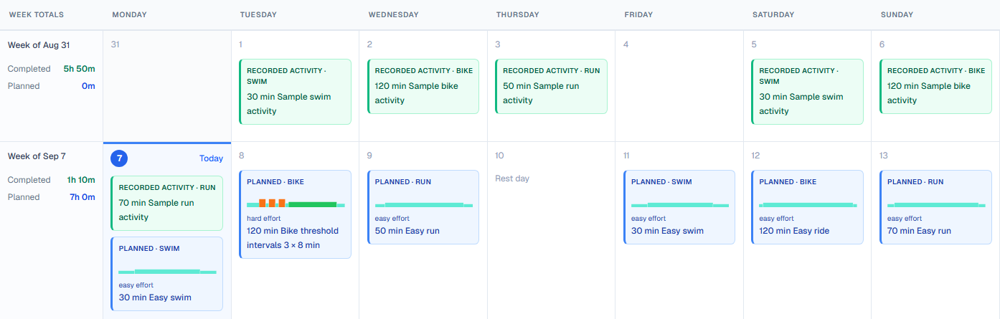
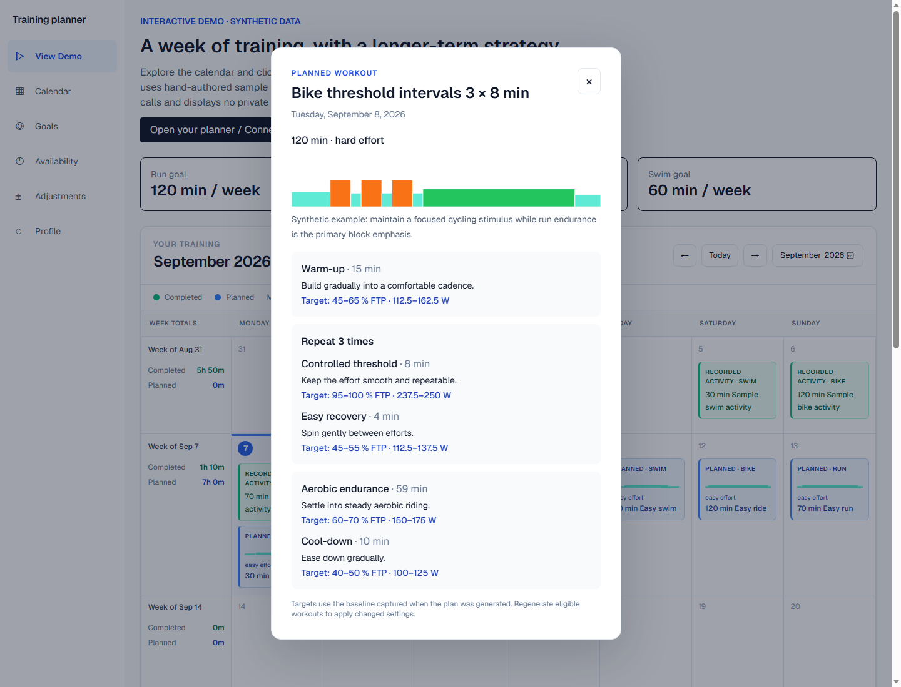
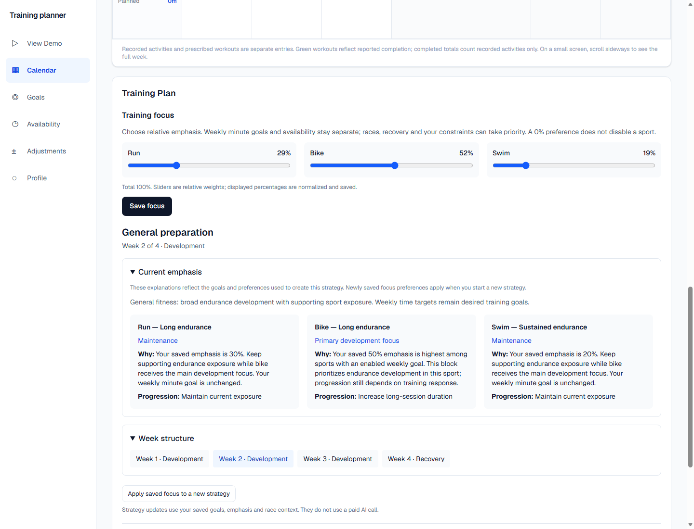
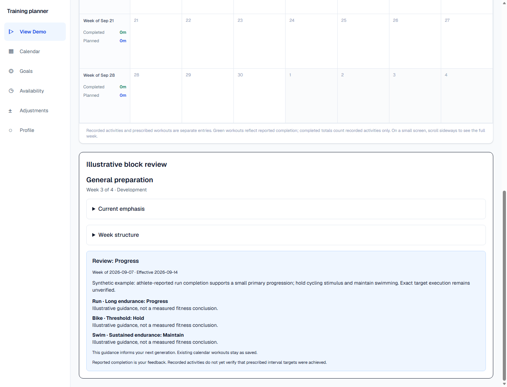
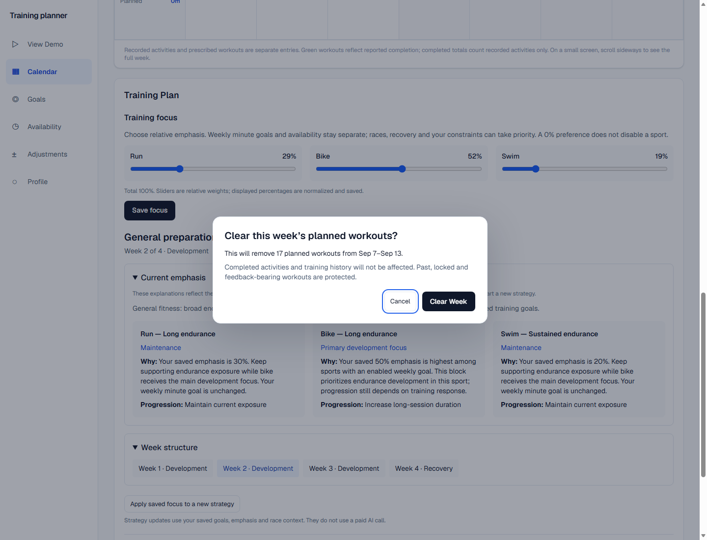
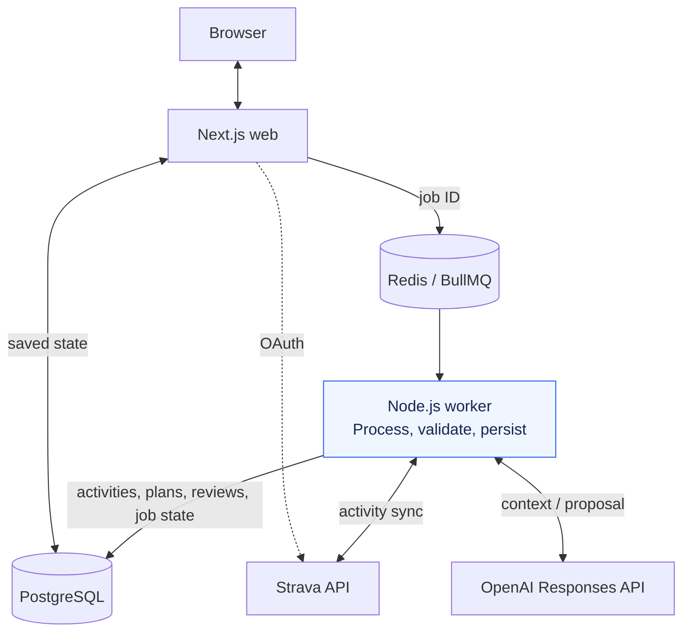
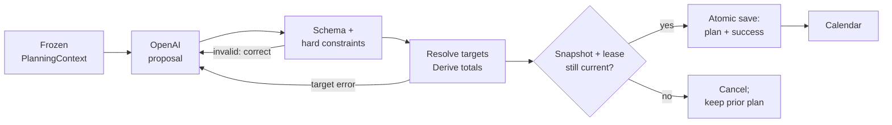

# AI Triathlon Training Planner

Turn Strava history, race goals, availability and athlete feedback into structured, adaptive swim, bike and run training plans.

**LLM proposes. Deterministic code validates. PostgreSQL owns the saved plan.**

[Demo & screenshots](#screenshots-and-demo) · [Architecture](#architecture) · [Local setup](#local-setup) · [Tests](#testing)

<a href="docs/screenshots/readme-calendar.png"></a>

- **Async Strava ingestion:** OAuth, token refresh, paginated sync and idempotent activity upserts.
- **Structured AI workouts:** repeated intervals, resolved power/pace/HR targets and deterministic constraint checks.
- **Adaptive training blocks:** persistent multi-week strategy, weekly reviews and per-focus progression guidance.
- **Athlete-controlled planning:** weekly goals, sport emphasis, availability, feedback and protected-workout regeneration.

*Screenshot uses synthetic data. [Run the interactive demo locally](http://localhost:3000/demo) after setup; no public demo URL is configured in this repository.*

## Screenshots and demo

The read-only `/demo` uses the application's calendar, workout details and block summary with hand-authored synthetic data. It requires no Strava account or paid AI call. It demonstrates the interface, not the quality of a live model response.

<details>
<summary>Explore workout details, training focus and an adaptive review</summary>

| Structured workout detail | Training focus and current emphasis |
| --- | --- |
| [](docs/screenshots/demo-workout.png) | [](docs/screenshots/training-plan-emphasis.png) |

| Adaptive block review | Clear-week confirmation |
| --- | --- |
| [](docs/screenshots/demo-review.png) | [](docs/screenshots/training-plan-clear.png) |

All screenshots use synthetic fixtures. [Capture instructions and provenance](docs/screenshots/README.md).

</details>

## Product overview

Training across three sports means balancing competing goals with the time, facilities and recovery available each week. Connect Strava, sync recent activities, then configure desired weekly minutes, race priorities, baseline metrics, available days and relative sport emphasis. Without an upcoming race, the planning objective is General Fitness.

A separate worker generates structured weekly workouts. Application code checks the proposal, resolves targets against saved baselines and persists the accepted plan for the calendar. Workout details reveal interval instructions on click; completion, perceived exertion (RPE) and comments provide feedback for later planning.

A persistent training block supplies continuity between weeks. Reviews can progress, hold, bring recovery forward, continue recovery, complete the block or request a new strategy. These decisions inform subsequent generation; they do not silently rewrite the calendar.

## Architecture



The web app handles interactive traffic; the worker handles external API calls and background processing. They are separate deployable processes in an **npm-workspaces monorepo**, with no imports between `apps/web` and `apps/worker`. Both use `packages/db` for database access and `packages/shared` for contracts.

PostgreSQL stores requests, activity history, plans and reviews. BullMQ carries small persistent IDs; the worker loads the data it needs. The browser polls saved status and calendar data. [Architecture details and source map](docs/architecture.md).

## AI planning design

**The LLM is a proposal provider inside the planning system. It cannot directly write a plan or change the athlete's goals.**



| Model proposes | Deterministic/server code controls |
| --- | --- |
| Workout selection and its explanation | Authenticated ownership, immutable goals and protected workouts |
| Frequency, duration distribution and progression tradeoffs | Valid dates, replacement window, allowed sports, pool access and daily/session limits |
| Repeated intervals and relative intensity targets | Schema, duration arithmetic, percentage units and baseline-based target resolution |
| Block-review decision and per-focus actions | Valid focus IDs, lifecycle rules, snapshot freshness and transactional persistence |

The worker uses the **OpenAI Responses API with Zod-derived Structured Outputs**. Local validation still runs on every proposal. For example, 88% FTP is encoded as `88`, not `0.88`; the server resolves it against the saved cycling baseline. Missing baselines require an available target type such as RPE.

An invalid proposal receives structured correction feedback: **three total proposal attempts maximum**—the initial proposal plus up to two corrections. Exhaustion, refusal or a stale result preserves the previously saved plan. Transient infrastructure retries are a separate mechanism and can cause additional API calls.

Weekly minutes remain **desired training goals**, not just availability ceilings. Deviations and hard-session clustering are exposed for review rather than universally rejected. Validation prevents malformed or hard-constraint-violating proposals from being saved; it does not establish physiological safety or optimal coaching.

Read the [proposal finalizer](packages/shared/src/plan-generation.ts), [target resolver](packages/shared/src/workout-targets.ts) and [job persistence](packages/db/src/plan-jobs.ts), or the [detailed AI design](docs/openai-planner.md).

## Adaptive block review

`Saved week + activity summaries + feedback` → `BlockReviewContext` → `worker reviewer` → `lifecycle decision + per-focus guidance` → `next PlanningContext`

A **training block** (`DevelopmentBlock` in code) stores its phase, week structure, sport/capability focuses and rationale. Initial block selection is deterministic: General Fitness considers saved sport-emphasis preferences, with rotation when no preference is set; race-targeted selection uses event priority, demands and dates. The weekly AI receives that persistent strategy.

Reviews separate two decisions:

- **Block lifecycle:** progress, hold, recover early, continue recovery, complete or replan.
- **Individual focus:** progress, hold or maintain. A successful run focus can progress while a struggling bike focus holds.

The evidence model distinguishes athlete-reported completion from measured execution. RPE and comments provide context; missing data remains unknown. Linked-activity evidence can represent recorded duration, but **the current application does not link activities to prescribed workouts**: Strava totals remain separate background evidence, not proof of interval execution.

Reviews append to block history. A completed or invalidated block can be followed by a new strategy. Saving sport emphasis affects future block creation/replanning. Create or replace a strategy to apply those preferences, then regenerate eligible workouts to bring that strategy into the calendar. [Review identity and validation](docs/block-review-focus-identity.md) · [Training Plan controls](docs/training-plan-ui.md).

## Reliability and engineering decisions

- **Durable dispatch:** save a `JobRun` before enqueueing its ID. Recovery scans reconcile pending jobs after interruption; attempts, retry times and leases live in Postgres.
- **Idempotent ingestion:** sync the most recent 90 days with paginated Strava requests. A unique Strava activity ID plus ownership-checked upserts prevents duplicate activity rows on repeated syncs.
- **Bounded retries:** sync has five infrastructure attempts; weekly generation and review have three. Backoff and provider rate-limit delays handle transient failures. SDK automatic retries are disabled so application policy controls retry behavior.
- **Atomic acceptance:** save the accepted weekly plan and successful job state in one transaction. Reviews likewise append their result and mark success together. Database transactions do not span OpenAI calls.
- **Concurrent edits:** per-athlete coordination prevents sync, generation and review requests from overlapping. Snapshot and lease checks reject stale results; existing plans survive failures. Snapshot comparisons tolerate only floating-point serialization round-off.
- **Protected history:** regeneration retains past, locked and completed/modified/stopped workouts. Week clearing additionally preserves feedback-bearing workouts and never deletes activities or block/review history.
- **Environment boundaries:** OpenAI configuration belongs to the worker. Web and worker must share the intended database and queue namespace; development and deployment credentials remain separate.

A crash can repeat an external call before its response is persisted. This is not an exactly-once API execution guarantee.

## Tech stack

| Layer | Implementation |
| --- | --- |
| Web | Next.js **16.1.1**, React 19, TypeScript, Tailwind CSS 4 |
| Background processing | Node.js, BullMQ, Redis 7, ioredis |
| Persistence | Prisma 7, PostgreSQL 16 |
| AI contracts | OpenAI Node SDK, Responses API, Structured Outputs, Zod |
| Integration | Strava OAuth and REST API |
| Local infrastructure | Docker Compose for PostgreSQL and Redis |

Vercel web with managed storage and a separate worker is a [documented deployment target](docs/deployment.md), not a verified hosted deployment.

## Repository structure

```text
apps/
  web/       Next.js calendar, settings, sessions and queue-producing endpoints
  worker/    BullMQ consumer, Strava ingestion, OpenAI adapters and job recovery
packages/
  db/        Prisma schema/migrations, database services and transactional saves
  shared/    Zod schemas, planning context, workout targets and domain validators
scripts/     Isolated tests, scenario evaluations and synthetic demo tooling
docs/        Current architecture, review guides, screenshots and design history
```

## Local setup

**Prerequisites:** Node.js 24, npm and Docker with Compose. Local verification used Node.js **24.12.0** and npm **11.6.2**. Commands below are PowerShell, run from the repository root.

```powershell
git clone https://github.com/zfl1rice/strava-training-planner.git
cd strava-training-planner
npm ci

# Preserve existing files when updating a checkout.
if (!(Test-Path .env)) { Copy-Item .env.example .env }
if (!(Test-Path apps/web/.env.local)) { Copy-Item apps/web/.env.example apps/web/.env.local }
if (!(Test-Path apps/worker/.env.local)) { Copy-Item apps/worker/.env.example apps/worker/.env.local }
```

Match the database/Redis values in root and web environment files. For the authenticated app, add your Strava API app credentials in both files, set its callback domain to `localhost`, and use `http://localhost:3000/api/strava/callback` as the redirect URI.

```powershell
docker compose up -d --wait postgres redis
npm run db:generate
npm run db:deploy
npm run dev
```

Open [the planner](http://localhost:3000) or [the read-only synthetic demo](http://localhost:3000/demo). Root `predev` builds shared packages, then `dev` starts web and worker. Restart the worker after code or configuration changes.

The default weekly provider is deterministic, so initial local planning needs no OpenAI key. For live weekly generation **and block reviews**, set `PLANNER_PROVIDER=openai` and the worker key. Reviews require OpenAI configuration; simulated review fixtures remain available without it.

**Windows dev fix:** `npm run dev` explicitly uses **Webpack** for Next.js 16.1.1. Turbopack dev reproduced runaway PostCSS child processes with an existing Windows dev cache. Webpack retains Tailwind and Fast Refresh; production still uses `next build`. Use the repository dev scripts. [Investigation and bounded-process checks](docs/dev-process-spawn.md).

`npm run check:local` checks configuration, Postgres and Redis without printing secrets or making paid calls.

<details>
<summary>Production-style local startup</summary>

After environment setup and migrations:

```powershell
npm run build
npm run start --workspace @app/web
```

In a second terminal at the repository root:

```powershell
npm run start --workspace @app/worker
```

Keep both processes running. The build needs outbound access for the existing Google font imports.

</details>

## Environment variables

Use the [root example](.env.example), [web example](apps/web/.env.example) and [worker example](apps/worker/.env.example) as the configuration reference.

| Scope | Variables |
| --- | --- |
| Local Compose | `POSTGRES_USER`, `POSTGRES_PASSWORD`, `POSTGRES_DB` |
| Web and worker infrastructure | `DATABASE_URL`, `REDIS_URL`; optional matching `BULLMQ_PREFIX` |
| Strava server credentials | `STRAVA_CLIENT_ID`, `STRAVA_CLIENT_SECRET`, `STRAVA_REDIRECT_URI` |
| Worker AI | `PLANNER_PROVIDER`, `OPENAI_API_KEY`, `OPENAI_PLANNER_MODEL` |
| Worker request limits | `OPENAI_PLANNER_TIMEOUT_MS` (75,000 default), `OPENAI_PLANNER_MAX_OUTPUT_TOKENS` (16,000 default) |
| Web diagnostics | `ENABLE_PING_DIAGNOSTICS=false` unless explicitly testing Ping |

The configured model default is `gpt-5.6-luna`; set a Responses/Structured Outputs model accessible to your API account. This identifies the repository default, not a promise of model access or pricing.

**Never expose `OPENAI_API_KEY` or `STRAVA_CLIENT_SECRET` through `NEXT_PUBLIC_*` variables.** Keep the OpenAI key out of the web environment. Worker loading order is existing process variables, `apps/worker/.env.local`, then root `.env`.

## Testing

The latest application checkpoint passed **268 tests across 17 suites**, plus TypeScript, lint, worker compilation, production web build and synthetic browser checks. This count comes from the recorded full-suite run, not the number of test files. [Verification record](docs/training-plan-ui.md#validation).

```powershell
npm test
npm run typecheck
npm run lint
npm run build
```

The full suite uses disposable Postgres databases, isolated Redis prefixes and mocked/deterministic providers. Start local Compose first; its database role needs permission to create/drop test databases. No paid AI calls are made.

| Area | Focused commands |
| --- | --- |
| Strava OAuth / ingestion | `npm run test:strava` · `npm run test:sync` |
| Weekly planning / AI adapter | `npm run test:adaptive` · `npm run test:semantics` · `npm run test:openai` |
| Blocks / review lifecycle | `npm run test:blocks` · `npm run test:block-reviews` · `npm run test:review-jobs` |
| Local scenario evaluations | `npm run evaluate:planner` · `npm run evaluate:blocks` · `npm run evaluate:block-review` |

Evaluations use synthetic contexts and do not write application records. Default evaluators remain local even when the worker is configured for OpenAI.

<details>
<summary>Optional paid evaluation: one selected scenario</summary>

These commands make external OpenAI calls and incur API usage. Configure the worker first. Each selected scenario can make up to three proposal calls; run one command at a time. Omitting `--scenario` evaluates the broader set.

```powershell
npm run evaluate:planner:openai -- --scenario general-fitness-active-block *> general-fitness-active-block.log
```

Or evaluate a review boundary:

```powershell
npm run evaluate:block-review:openai -- --scenario replan-new-race *> block-review-replan-new-race.log
```

The ignored log captures long PowerShell output. Structural validation and reference comparisons support human review; they do not prove coaching quality. [Live UI smoke checklist](docs/local-product-smoke.md).

</details>

## Deployment

The intended deployment separates **Vercel web**, **managed PostgreSQL**, **TCP Redis/BullMQ**, and a **separate worker** on a server or the owner's machine. Register a stable production Strava callback and keep the OpenAI key worker-side.

[Deployment guide](docs/deployment.md) covers build roots, environment separation, migrations and verification. A local worker must stay awake and running. No hosted deployment, uptime, free-tier availability or usage-cost claim is made here.

## Intentional limits

- Day-level scheduling; generation covers the current-week remainder or next week.
- Initial block selection is deterministic; sport percentages express preference, not proportional minute allocation or inferred weakness.
- Automatic PR extraction, inferred fitness profiles, baseline updates and physiological load models remain deferred.
- No automatic activity-to-workout linking or interval-execution analysis; raw Strava streams are not stored.
- Calendar export, weather-aware scheduling and advanced multi-race periodization remain deferred.
- Public account administration and abuse controls are outside the current personal/small-group scope.

## Further reading

[Documentation index](docs/README.md) · [Architecture and code entry points](docs/architecture.md) · [Training Plan UI and protection rules](docs/training-plan-ui.md) · [Deployment](docs/deployment.md)
