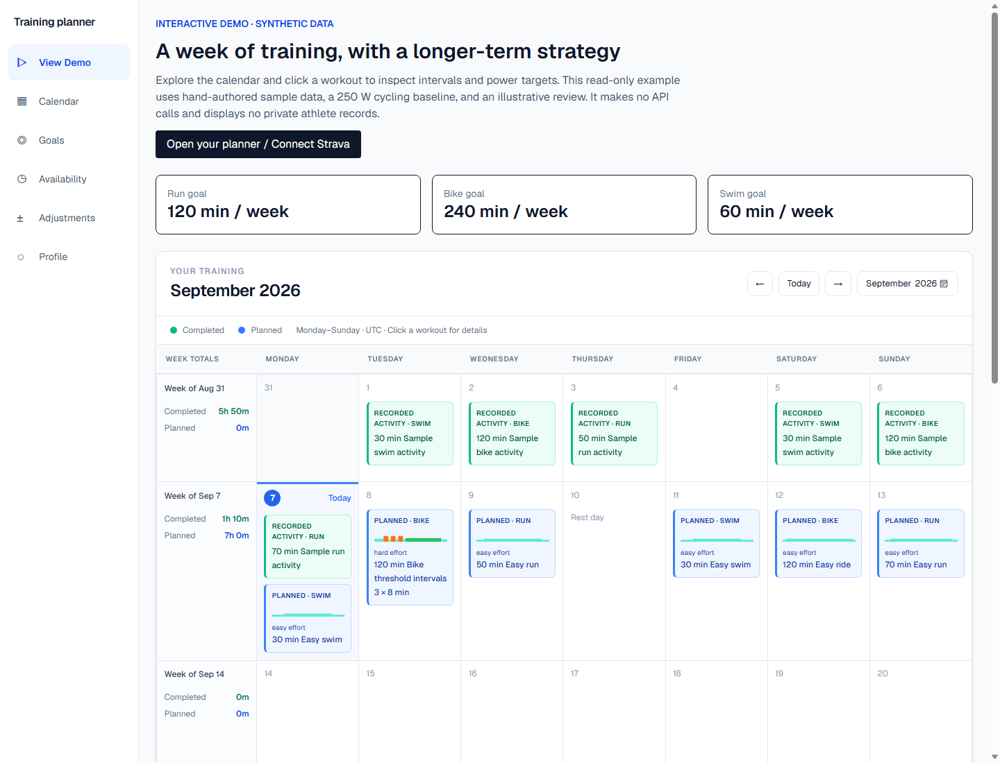
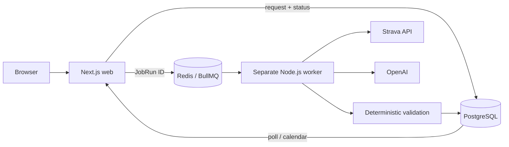

# AI Triathlon Training Planner

A training calendar that turns Strava history, weekly goals, availability, and athlete feedback into structured swim, bike, and run plans. Built to explore a practical boundary for AI: a model proposes workouts and coaching guidance; application code owns identity, validation, persistence, and which results may take effect.

**Try it locally:** [Open planner](http://localhost:3000) · [View synthetic demo](http://localhost:3000/demo)

**Demo link:** add your deployed `/demo` URL here after deployment. No production deployment is claimed.



[Workout detail](docs/screenshots/demo-workout.png) ? [Block review](docs/screenshots/demo-review.png) ? [Screenshot checklist](docs/local-product-smoke.md#screenshots)

## What works

- Strava OAuth, server-side token refresh, asynchronous paginated ingestion, and unique activity-ID upserts.
- Goals, baseline metrics, race priorities, availability, restrictions, and temporary adjustments.
- Worker-side OpenAI weekly generation with typed structured output, deterministic validation, bounded corrections, and persisted request status.
- Calendar polling, concise workout cards, interval charts, grouped repeats, relative/resolved targets, and RPE/completion feedback.
- Persistent DevelopmentBlocks and queued OpenAI BlockReviews with per-focus progression guidance.
- A read-only, synthetic demo requiring no Strava account, database data, or paid API call.

The app is intended for personal/small-group use. It does not infer diagnoses, automatically extract PRs, or implement a physiological load model. The demo is hand-authored; it is not evidence of a live AI generation.

## Architecture



| Area | Responsibility |
| --- | --- |
| `apps/web` | Next.js UI, opaque-cookie sessions, authenticated endpoints, queue producers |
| `apps/worker` | BullMQ consumer, Strava ingestion, OpenAI adapters, missing-job recovery |
| `packages/db` | Prisma access, snapshots, job ownership, transactional persistence |
| `packages/shared` | Zod contracts, workout representation, deterministic validation, planning/review semantics |

Web and worker are separate deployables and never import one another. Shared code stays in packages. PostgreSQL is the source of truth; queue payloads contain only persistent IDs.

## Engineering decisions

**Durable asynchronous work.** Web saves a request before enqueueing it. A worker recovery scan finds missing jobs. Attempts, leases, and status live in Postgres. Short per-athlete locks serialize changes; no database transaction spans an OpenAI request.

**Idempotent ingestion.** Strava activity IDs are unique. Re-syncing upserts existing activities rather than creating duplicates. Token refresh is serialized; ingestion retries transient failures with backoff and rate-limit delays.

**AI as a proposal provider.** Worker configuration selects deterministic or OpenAI generation. Code constructs a bounded context and resolves workout targets against recorded baselines. Zod and semantic checks enforce dates, workout identity, duration arithmetic, availability, restrictions, target units, and protected workouts. Invalid proposals receive at most three correction attempts. Validation does not prove coaching quality.

**Stale-result protection.** Jobs freeze input snapshots. Changes to relevant goals, feedback, history, strategy, or dates invalidate old work. Failed/cancelled generation retains the previous calendar. Reviews append atomically and retain historical strategy. Sync, weekly generation, and review requests do not overlap for an athlete.

**Goal semantics.** Weekly minutes are desired training goals, not merely availability ceilings. The model must explain meaningful deviations. Recovery, restrictions, and availability can justify less volume; “minimum effective dose” does not mean always prescribing less.

**Training-block lifecycle.** The first UI generation creates a deterministic starter block if one is missing. General Fitness rotates a broad primary sport; race-targeted defaults use stored priority, demands/duration, and race dates. The panel can explicitly replace a block without changing existing workouts. Weekly OpenAI generation receives this persistent context.

Review Week snapshots real saved plans, athlete-reported completion/RPE/comments, activity summaries, and current settings. The worker produces PROGRESS, HOLD, RECOVER_EARLY, CONTINUE_RECOVERY, COMPLETE_BLOCK, or REPLAN_BLOCK, plus PROGRESS/HOLD/MAINTAIN for each immutable focus ID. A terminal review closes the block; the next generation can create its successor. Existing calendar workouts change only when generation is requested.

**Evidence honesty.** Reported completion is not measured execution. Unlinked Strava totals are separate from prescribed minutes; interval compliance, automatic strengths/weaknesses, and baseline estimation remain deferred.

## Local setup

Run commands from the directory containing this README and the root `package.json`. Use Node.js 22 or 24, npm, and Docker Desktop. This checkpoint was tested with Node.js 24.

For a new checkout, copy `.env.example` to `.env` and `apps/web/.env.example` to `apps/web/.env.local`. Preserve existing credentials when updating. Set matching database/Redis settings and your Strava application credentials. Set the Strava callback domain to `localhost` and callback URI to `http://localhost:3000/api/strava/callback`.

```powershell
npm install
docker compose up -d postgres redis
npm run db:generate
npm run db:deploy
npm run dev
```

Open http://localhost:3000. The development command starts web and worker. Restart the worker after configuration/code changes. The root predev script builds shared packages.

Web development explicitly uses **Webpack** on Next.js 16.1.1. Turbopack dev reproduced runaway PostCSS child processes on Windows with an existing dev cache; Webpack avoids that process-pool path while retaining Tailwind and Fast Refresh. Production builds are unchanged. See [the investigation and verification results](docs/dev-process-spawn.md).

### Environment variables

| Variable | Location / purpose |
| --- | --- |
| `POSTGRES_USER`, `POSTGRES_PASSWORD`, `POSTGRES_DB` | Root `.env`; local Compose database |
| `DATABASE_URL` | Root + web local env; persistent application database |
| `REDIS_URL` | Root + web local env; same TCP Redis instance |
| `BULLMQ_PREFIX` | Optional; must match web and worker; default `bull` |
| `STRAVA_CLIENT_ID`, `STRAVA_CLIENT_SECRET` | Root + web local env; OAuth and refresh |
| `STRAVA_REDIRECT_URI` | Web/root; exact callback URL and allowed request origin |
| `PLANNER_PROVIDER` | Worker only: `deterministic` default, or `openai` |
| `OPENAI_API_KEY` | Worker only; required for live generation/reviews |
| `OPENAI_PLANNER_MODEL` | Worker; model identifier available to your API account |
| `OPENAI_PLANNER_TIMEOUT_MS` | Worker; default 75000 |
| `OPENAI_PLANNER_MAX_OUTPUT_TOKENS` | Worker; default 16000 |
| `ENABLE_PING_DIAGNOSTICS` | Web; false unless explicitly testing Ping |

For live generation, copy `apps/worker/.env.example` to `apps/worker/.env.local` **only if it does not already exist**. Set `PLANNER_PROVIDER=openai` and your key there. Do not put the key in web or any `NEXT_PUBLIC_*` variable. The worker reads this file, then root `.env`; already-set process variables take precedence.

`npm run check:local` checks configuration and local infrastructure without printing secrets or making paid calls. A blank key is reported as a setup item. This is not a substitute for a live smoke test.

## Run and verify

```powershell
npm test
npm run typecheck
npm run lint
npm run build
npm run evaluate:planner
npm run evaluate:blocks
npm run evaluate:block-review
```

The full suite uses disposable Postgres databases and isolated Redis prefixes. Its database user needs CREATE DATABASE permission. Provider calls are mocked. Existing individual commands such as `test:sync`, `test:openai`, `test:block-reviews`, and `test:review-jobs` remain available.

The free fixtures cover weekly planning, strategic blocks, and review boundaries. Runtime logs record provider-call latency, tokens (unknown when unreported), correction attempt, infrastructure attempt, model, and response ID. Sync status shows activities processed, not a fabricated “new activities” count. See [checkpoint results](docs/resume-ready-checkpoint.md) for the verified test count.

One **optional paid evaluation**, run manually:

```powershell
npm run evaluate:planner:openai -- --scenario general-fitness-active-block *> general-fitness-active-block.log
```

Evaluator output does not create application records. To prove the actual UI path, follow [the local product smoke checklist](docs/local-product-smoke.md).

## Demo and deployment

`/demo` reuses the calendar, grouped workout details, and block summary with a checked-in synthetic fixture. No demo account or database seed is required. `npm run demo:build` rebuilds only that fixture; it never alters an athlete's data.

[Deployment guide](docs/deployment.md): Vercel web, hosted Postgres/Redis, and a local worker initially. No deployment is performed by setup or build scripts. A sleeping/offline local worker delays queued jobs. OpenAI API usage remains a separate cost.

## Further reading

- [Local audit](docs/resume-readiness-audit.md)
- [Checkpoint results and file map](docs/resume-ready-checkpoint.md)
- [Detailed design](docs/design.md)
- [OpenAI weekly planner](docs/openai-planner.md)
- [Development blocks](docs/development-blocks.md)
- [Review evidence and focus identity](docs/block-review-focus-identity.md)
- [Review decision-boundary scenarios](docs/block-review-boundaries.md)

Deferred: automatic PR extraction, stream analysis, inferred fitness profiles, baseline updates, TSS/CTL/ATL, calendar integrations, advanced multi-race optimization, social features, and a comprehensive production authentication system.
