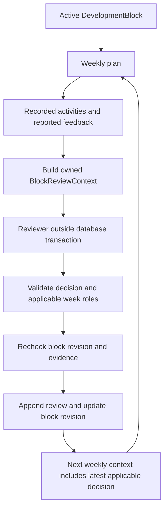

# Adaptive block-review checkpoint

**Current model contract:** [stable focus IDs](block-review-focus-identity.md).
The model returns `focusId`, action, and rationale; the server resolves full metadata.

**Latest refinement:** [evidence semantics and per-focus guidance](block-review-focus-guidance.md)
supersedes the original proposal/evidence descriptions below. New proposals require
`focusGuidance`; new evidence distinguishes reported prescription minutes from linked
recorded execution. Historical v1 reviews remain readable.

Implemented September 7, 2026. This checkpoint connects recorded weekly response to a persistent block decision and the next weekly planning context. It also improves workout-construction guidance. It preserves the existing weekly planner, numerical target resolver, athlete goals, and separate web/worker applications.

**Operational status:** explicit local reviews can capture evidence and save a supplied recommendation. The OpenAI reviewer is available through an opt-in evaluation command only. Production review requests, BullMQ dispatch, and automatic week-boundary scheduling are not enabled. No paid call was made during implementation.

## Flow and boundaries



The application currently uses a simulated reviewer whose decision and rationale are supplied explicitly. It does not derive a decision from an RPE threshold or automatically interpret comments. The same contract accepts the OpenAI evaluator, which interprets synthetic evidence without writing application records.

A review covers a started local Monday–Sunday week and applies to the following Monday. That following week must be current or upcoming: the boundary service rejects obsolete or future review windows. A review during an unfinished week is marked partial; future planned sessions are not assumed missed. The older administrative `review` command remains available for explicitly closing an expired block or supplying a future pattern.

## Evidence contract

`BlockReviewContext` contains:

| Field | Meaning |
| --- | --- |
| `version`, `athleteId` | Contract version and internal ownership identity |
| `sourceFingerprint` | SHA-256 fingerprint of the captured planning inputs and recorded activities; used for stale-result rejection |
| `block` | Active block ID/revision, phase, dates, derived week index/role, focuses and progression strategies, race references, concise previous applicable review |
| `planningObjective`, `goals` | Current general-fitness/race objective and desired sport minutes; goals remain athlete-owned |
| `effectiveWeekStart`, `remainingWeekPattern` | Following Monday and the currently planned future roles |
| `evidence` | Versioned facts described below |

The evidence snapshot records capture time, athlete time zone, reviewed date range, whether the week is complete, and saved-plan ID/update time/block provenance. Planned workouts include ID, date, sport, title, minutes, effort, optional/locked status, actual stored completion state, and any reported RPE/comment.

Per-sport calculations include planned/recorded minutes, planned/recorded session counts, longest planned/recorded session, and explicitly reported completed-session counts. Activity totals come from owned database records in the athlete's local date range, through the capture time. They are calculated before truncating the detailed activity list to 500 entries. At most 168 planned workouts and three recent history weeks are included.

Current and next-week restrictions/dated adjustments, next-week availability, races, and uncertainty notes complete the context. A restriction or race in the current profile is not necessarily a new change; the reviewer must use available prior context and acknowledge uncertainty.

There is currently no persistent activity-to-workout link or measured interval execution. Therefore `activityLinkingAvailable` is `false`, and `achievedTargets` is `null`. Recorded activity is not proof that a prescribed workout or intensity target was completed. `UNREPORTED` means unknown completion, not failure. Comments remain attributed athlete reports, not physiological facts. No raw streams, tokens, credentials, or unrelated history enter the context. The OpenAI projection also omits internal athlete identity and the freshness fingerprint.

## Persistent shape and database changes

This checkpoint reuses the existing `DevelopmentBlock` and `DevelopmentBlockReview` tables. **It adds no migration.** The earlier development-block migration remains required and is already present in the working tree.

Each review row has its block ID, resulting block revision, decision, reviewed/effective week starts, creation time, and JSON content:

```text
content
  request: reviewedWeekStart, effectiveWeekStart, decision, rationale,
           optional remainingWeekPattern
  response: concise calculated sport totals, feedback, restrictions,
            availability, notes, capture time, known evidence references
  evidence: versioned detailed BlockReviewEvidence snapshot
  source: provider, version, model, responseId
```

`source.version` is `block-review-v1`. Saved local reviews use provider `SIMULATED` and null model/response ID. Evidence and source are optional when reading older records. The reviewed week index is derived from the block start and review date rather than stored redundantly.

Regeneration appends a new row and increments the block revision. Previous rows and the original block proposal are retained. Future role overrides are folded over the original pattern; past week roles are not rewritten. Completed, modified, locked, and other saved workout history is untouched. The weekly context includes the most recent applicable review's concise response, omitting the detailed evidence snapshot to avoid repeatedly sending it to weekly generation.

## Decisions and future behavior

| Decision | Future roles and lifecycle | Weekly planning meaning |
| --- | --- | --- |
| `PROGRESS` | Preserves the planned development role. A successful recovery may resume development; at the pattern end it can append one development week. Existing upcoming taper/race roles are retained. | Permit the smallest useful progression within the declared focus strategy; no automatic numeric increase. |
| `HOLD` | Keeps the block active and normally retains its future pattern. At the pattern end, adds one development week, or recovery if the reviewed week was recovery. | Preserve a similar stimulus without deliberately progressing it. Scheduling and workout details may vary. |
| `RECOVER_EARLY` | Requires the next planned role to be development and changes that role to recovery, preserving the remaining tail. | Reduce fatigue coherently while retaining useful exposure. No fixed three-week prerequisite. |
| `CONTINUE_RECOVERY` | Requires a reviewed recovery week; the next role becomes/remains recovery, extending the pattern if needed. | Do not return to development merely because the calendar's recovery week ended. |
| `COMPLETE_BLOCK` | Appends the review and sets block status to `COMPLETED`. | Select/create the next block before normal weekly generation resumes. |
| `REPLAN_BLOCK` | Appends the review and sets block status to `ABORTED`. | Replace the strategy before normal weekly generation resumes. One poor workout alone is not a reason to invalidate the strategy. |

Development role alone does not authorize progression. An applicable decision and supplied response guide the weekly planner. Missing feedback is uncertainty, not an automatic HOLD rule; completing maintenance work alone does not establish readiness to progress a different primary focus.

PROGRESS authorizes a direction, not arithmetic. For `RUN / LONG_ENDURANCE / LONG_SESSION`, the weekly AI may increase a long run from 60 to 70 minutes and reduce another from 60 to 50, maintaining a 120-minute goal. TIME_AT_INTENSITY, REPETITIONS, INTERVAL_DURATION, FREQUENCY, and VOLUME similarly identify which dimension to consider. The reviewer does not increase them all or change baselines. The existing deterministic weekly planner remains available; it does not gain an inferred coaching engine in this checkpoint.

After a terminal decision, `PlanningContext.blockTransition` reports the closed block and need for replacement. An active block whose pattern does not cover the target week also blocks normal generation until review/replacement. These cases cannot silently resume independent generic weeks. Athletes who have never created a block retain the existing no-block behavior. General-fitness and race-targeted blocks use the same review pipeline.

## Workout construction and naming

The weekly instructions now say to design the main stimulus first, use suitable warm-up/cool-down durations, and allocate useful remaining time to purposeful aerobic, technique, or other supporting work. Desired training minutes remain goals. A justified shortfall is preferable to low-value padding, but “minimum effective dose” does not mean always prescribing less.

There is no universal warm-up/cool-down cap. The schema regression deliberately still accepts a structurally valid session with a 33-minute cooldown: coaching quality is reviewed separately from structural validity. Titles and explanations must match prescribed intensity; useful sub-threshold work should be described accurately rather than intensified simply to justify a threshold title. No new zone taxonomy or numerical target formula was introduced.

## Provider and concurrency architecture

`BlockReviewer.review(context, attempt)` is logically separate from weekly plan generation. Its structured response is only `{ decision, rationale }`. Deterministic validation checks shape and decision/role compatibility. Up to three proposals can be attempted with validation errors supplied for correction. The live evaluator uses the existing model/configuration and official SDK transport, including timeout, cancellation, provider errors, usage accounting, and Structured Outputs. That transport was extracted from `openai-planner.ts` so both providers share it; there is no second client stack.

`reviewAndSaveBlockWeek` captures context under the existing athlete training lock, releases the transaction, runs the reviewer, then reacquires the lock and compares the block revision and complete context. Changes to feedback, activities, availability, goals/profile, sync state, or strategy invalidate the snapshot; a local date rollover also rejects it. Review insertion and block update commit together. No transaction stays open during reviewer work.

The production service explicitly rejects `OPENAI` reviewers today. Before enabling application live reviews, add a persistent request with frozen context/status and an ID-only BullMQ job using the existing worker infrastructure. The worker should use the same review contract, correction/timeout handling, and guarded final write, with cancellation/retry/status tracking. Add explicit authenticated enqueueing or a week-boundary trigger then. Neither sync-triggered calls nor automatic review scheduling is implemented here. The snapshot/reviewer/commit foundation is ready; durable live execution itself is still deferred.

## Local use and evaluation

Run from the repository root. These commands make no OpenAI calls:

```powershell
npm run test:block-reviews
npm run evaluate:block-review
npm run blocks -- show 1
```

For an owned active block, put this in a local JSON file, using its actual ID/revision and the applicable reviewed Monday:

```json
{
  "blockId": 1,
  "expectedRevision": 1,
  "weekStart": "2026-09-07",
  "proposal": {
    "decision": "HOLD",
    "focusGuidance": [
      { "focusId": "RUN:LONG_ENDURANCE", "action": "HOLD", "rationale": "Repeat a similar primary stimulus before progressing." },
      { "focusId": "BIKE:THRESHOLD", "action": "HOLD", "rationale": "Preserve similar secondary work." },
      { "focusId": "SWIM:SUSTAINED_ENDURANCE", "action": "MAINTAIN", "rationale": "Preserve sufficient maintenance exposure." }
    ],
    "rationale": "The athlete reported unusually high effort in the key session; preserve a similar stimulus before progressing."
  }
}
```

The example assumes those three focuses; guidance must match every focus in the
actual block. Inspect the owned snapshot before explicitly saving a supplied recommendation:

```powershell
npm run blocks -- review-context 1 path/to/review-week.json
npm run blocks -- review-week 1 path/to/review-week.json
```

`review-context` is read-only and may print private athlete feedback; keep that output local. `review-week` writes the evidence/review and applies its lifecycle effect. The simulated source is recorded honestly; this is not an AI-generated recommendation. Generate the following week through the existing app after reviewing the saved decision. A terminal decision requires creating/replanning the block first.

The 18 free fixtures cover successful development, high RPE, stopped key work, repeated poor sessions with fatigue reports, continued recovery, successful recovery resumption, block completion, new race, new restriction, travel, sparse feedback, primary long-session development, secondary time-at-intensity, maintenance-only execution, general fitness, race targeting, availability-related partial adherence, and protected history.

Local fixtures validate explicit simulated recommendations and deterministic transitions, not AI coaching quality. A live result reports the reference decision for human comparison; a structurally valid alternative is not automatically called a failure. Summaries show the block/week/role/focus, decision, calculated volume and session evidence, reported RPE, rationale, and provider usage without dumping the full athlete context.

**Recommended first live review:** `successful-run-block`. It tests whether successful primary long-run execution supports targeted progression without demanding more total volume. With the existing worker OpenAI settings configured, this is the exact opt-in PowerShell command:

```powershell
npm run evaluate:block-review:openai -- --scenario successful-run-block *> block-review-successful-run.log
```

This can make up to three paid calls and writes no application records. It was **not run** during this task. Inspect the rationale and evidence attribution, not just validation status. The existing `general-fitness-active-block` weekly fixture remains the appropriate subsequent manual evaluation of block-guided workout construction; the new review evaluator alone does not demonstrate the live end-to-end coaching loop.

## Files and review priorities

| File | Change / responsibility | Review priority |
| --- | --- | --- |
| [block-review-evidence.ts](../packages/shared/src/block-review-evidence.ts) | New evidence/source contracts and sport calculations | Distinguish activity totals, reported completion, and uncertainty |
| [block-review.ts](../packages/shared/src/block-review.ts) | New reviewer contract, proposal validation/correction, deterministic role transitions | Decision semantics and pattern-end behavior |
| [development-block.ts](../packages/shared/src/development-block.ts) | Optional persisted evidence/source, evidence-week validation, compact weekly review projection | Backward compatibility and history |
| [block-reviews.ts](../packages/db/src/block-reviews.ts) | New owned snapshot builder and guarded review service | **Start here:** ownership, local dates, source freshness, transaction boundaries |
| [development-blocks.ts](../packages/db/src/development-blocks.ts) | Reuses review write inside the guarded transaction; persists evidence/source | Atomic history/revision update |
| [DB planning-context.ts](../packages/db/src/planning-context.ts), [shared planning-context.ts](../packages/shared/src/planning-context.ts) | Terminal block transition context | Replacement required after terminal decisions |
| [planner.ts](../packages/db/src/planner.ts), [plan-generation.ts](../packages/shared/src/plan-generation.ts) | Gate uncovered/terminal block generations | No generic fallback after strategy ends |
| [planner-prompt.ts](../apps/worker/src/planner-prompt.ts) | Purposeful construction, accurate titles, decision-aware coaching | **Coaching review:** enough stimulus, desired goals, targeted progression |
| [block-reviewer.ts](../apps/worker/src/block-reviewer.ts) | New opt-in OpenAI reviewer and compact input | Evidence attribution and minimal response |
| [openai-structured-response.ts](../apps/worker/src/openai-structured-response.ts), [openai-planner.ts](../apps/worker/src/openai-planner.ts) | Shared existing Responses transport; weekly wrapper retained | Weekly transport behavior unchanged |
| [manage-blocks.mjs](../scripts/manage-blocks.mjs) | Adds `review-context` and `review-week` commands | Explicit local writes and revision inputs |
| [evaluate-block-reviews.mjs](../scripts/evaluate-block-reviews.mjs), [block-review-scenarios.mjs](../tests/fixtures/block-review-scenarios.mjs) | New free/opt-in evaluator and 18 fixtures | Separate schema correctness from coaching quality |
| [block-reviews.test.mjs](../tests/block-reviews.test.mjs) | Sixteen contract, database, concurrency, prompt, and mocked-provider tests | Stale results, terminal gating, protected history |
| [shared index.ts](../packages/shared/src/index.ts), [DB index.ts](../packages/db/src/index.ts), [package.json](../package.json), [test-strava.mjs](../scripts/test-strava.mjs) | Exports and existing harness/command registration | Monorepo boundaries |
| README, design, review guide, MVP status, OpenAI guide, development-block guide, this document | Current operating instructions and scope | Production live-review limitation |

Existing uncommitted development-block and percentage-target work was preserved. Generated `dist` files are build output; review `src`.

## Validation and deferred work

All 218 tests pass, including 16 new review tests and 32 mocked OpenAI regressions. All 21 free weekly scenarios, 18 strategic block scenarios, and 18 review scenarios pass. Workspace TypeScript checks, web lint, Prisma validation/migration status, and the production build pass. The database suites use disposable isolated databases and apply all ten existing migrations. No real athlete block, workout, or review was created.

Deferred: durable production review jobs/automatic scheduling, review UI, live block-focus selection, automatic PR extraction, raw-stream or interval analysis, automatic strength/weakness inference, baseline updates, physiological load/readiness models, medical diagnosis, separate comment sentiment processing, custom race-demand generation, weather, and calendar integration. Numerical targets remain resolved by existing deterministic code.
