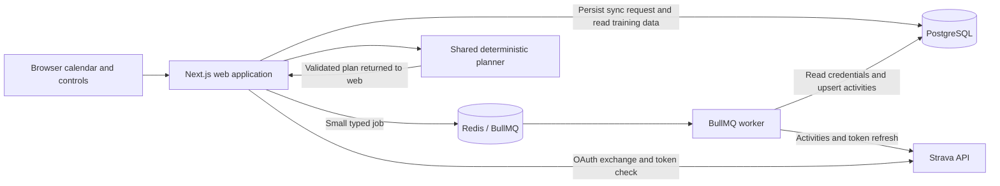
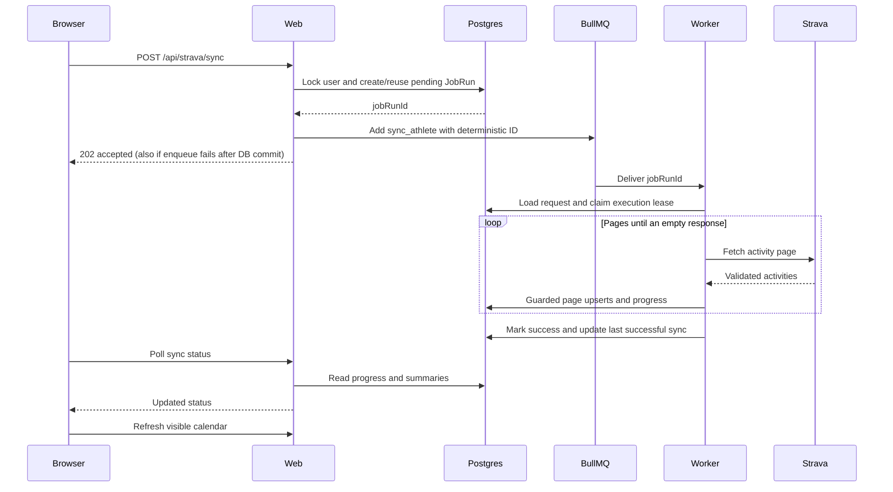

> Latest refinement: [explicit review evidence and per-focus guidance](block-review-focus-guidance.md).
> Block lifecycle decisions now remain separate from selective capability progression.

> Previous implementation: [adaptive block-review design](adaptive-block-reviews.md).
> Explicit reviews now persist evidence/decisions and guide future weeks. Terminal or
> uncovered blocks require review/replacement; live review dispatch is not enabled.

> Current generation semantics: see [AI readiness checkpoint](ai-readiness.md).
> It supersedes earlier hard-session/goal-cap rules for provider validation.

> September 7: [Persistent development blocks](development-blocks.md) now supply
> season phase, multi-week emphasis, and explicit review decisions to the working
> weekly OpenAI planner. Earlier statements below that AI is absent are historical.

# Triathlon training planner — detailed design

**Status:** Draft for review · **Date:** September 5, 2026

**Latest implementation addendum:** The [pre-AI generation checkpoint](pre-ai-checkpoint.md)
supersedes the fixed-schedule and synchronous-generation descriptions below. New plans
use v2 structured workouts, availability, adjustments, and the background worker.
The provider contract is implemented and tested with simulations; no AI calls exist.

**September 6 addendum:** The [PlanningContext checkpoint](planning-context.md)
documents the subsequently implemented profile/race/evidence foundation, local-date
context, and protected workout metadata. Its implementation notes supersede this
September 5 snapshot where they differ. The future provider is the OpenAI API;
no model integration has been implemented. A subsequent
[planning settings increment](planning-settings.md) adds the Profile, Goals, and
Availability screens without changing v1 generation behavior.

This document describes the September 5 working tree, including the new training
calendar. It also proposes a small path to the expanded pre-AI MVP. Proposed work
is explicitly labeled and is not implemented or approved merely by appearing here.
The calendar changes are present locally; this document does not imply deployment
or a GitHub push.

Use section numbers and decision IDs when proposing changes. The decision register
at the end includes space for your comments. For implementation navigation, use
the [complete source-file map](code-review.md#complete-file-map). For setup commands,
use the [README](../README.md). The [product vision](product-vision.md) and
[MVP checklist](mvp-status.md) remain the scope and progress references.

## Contents

1. [Product and scope](#1-product-and-scope)
2. [Architecture and ownership](#2-architecture-and-ownership)
3. [Data model](#3-data-model)
4. [Identity and Strava authorization](#4-identity-and-strava-authorization)
5. [Activity synchronization](#5-activity-synchronization)
6. [Recovery and concurrency](#6-recovery-and-concurrency)
7. [Training summaries](#7-training-summaries)
8. [Deterministic weekly planner](#8-deterministic-weekly-planner)
9. [Calendar and browser behavior](#9-calendar-and-browser-behavior)
10. [HTTP and job contracts](#10-http-and-job-contracts)
11. [Configuration and operations](#11-configuration-and-operations)
12. [Validation and known limits](#12-validation-and-known-limits)
13. [Proposed remaining pre-AI work](#13-proposed-remaining-pre-ai-work)
14. [Deferred extensions](#14-deferred-extensions)
15. [Decision register and change proposals](#15-decision-register-and-change-proposals)

## 1. Product and scope

### 1.1 Intended outcome

Reduce the mental work of organizing triathlon training. Eventually an athlete
should provide a race goal and real-life availability, connect training history,
and receive a realistic weekly swim/bike/run schedule. Completed training should
later inform future weeks.

The long-term product includes training analysis, workout selection, scheduling,
calendar organization, and adaptation. An LLM would be one constrained planning
component inside that system.

### 1.2 What works today

| Capability | Current behavior |
| --- | --- |
| Connection | Strava OAuth creates or reconnects the athlete's local account and browser session. |
| Ingestion | The user requests a sync; the worker imports the prior 90 days asynchronously. |
| Reliability | Idempotent activity writes, bounded retries, and automatic recovery of missing queued jobs. |
| Summaries | Current UTC week plus three previous weeks, per-sport volume, and total time. |
| Goals | Saved weekly minute targets for run, bike, and swim, with automatic and zero options. |
| Planning | A deterministic next-week plan selected from six easy templates. |
| Calendar | Green completed activities and blue planned workouts, weekly totals, and details on click. |
| Diagnostics | Dependency probes and an explicitly enabled Ping smoke path. |

Three distinctions matter when evaluating the design:

- **Automatic recovery is implemented; automatic periodic activity sync is not.**
  Recovery completes a request already recorded in Postgres. It does not periodically
  create fresh sync requests for every connected athlete.
- **An in-app calendar is implemented; Google Calendar integration is not.**
- **Training volume is calculated; fitness and readiness are not estimated.**
  Template limits are product rules, not measured athlete capacity.

### 1.3 Remaining pre-AI scope

The expanded MVP still needs structured race/profile inputs and a planner that
respects those inputs and availability. The current implementation does not use
race type, race date, experience, preferred rest days, or available time slots.

LLM integration, Google Calendar export, automatic adaptation, advanced physiological
models, elaborate periodization, template editing, and scaling work remain deferred.
Section 13 discusses a proposed implementation sequence without adding those features.

## 2. Architecture and ownership

### 2.1 Runtime architecture



Activity ingestion follows web → queue → worker → Strava → Postgres. OAuth exchange
and the explicit token-check endpoint run in web. Plan generation currently also
runs in web, using shared pure logic and DB-package transactions. The worker does
not generate plans. This keeps the small deterministic calculation synchronous
while moving the slow, retryable ingestion work off the HTTP request.

### 2.2 Code ownership

| Boundary | Owns | Must not own |
| --- | --- | --- |
| `apps/web` | Routes, session/origin checks, React state, UI, queue producers | Worker internals or activity-ingestion loops |
| `apps/worker` | Job dispatch, ingestion, retry policy, missing-job recovery, process lifecycle | Web routes, browser sessions, UI |
| `packages/db` | Prisma access, transactions, persistence, serialization of DB results | Browser rendering or BullMQ processing |
| `packages/shared` | Zod contracts, queue constants, pure summaries/planner/calendar logic | Prisma models or app-to-app imports |
| `@pkg/shared/strava` | Shared server HTTP client for token/activity requests | Client-side UI imports |

Web and worker remain separate deployable applications. Neither imports the other.
Both use the shared and DB packages. Database operations go through `@pkg/db`.

The shared Strava HTTP client has its own package entry point and is intentionally
excluded from the normal shared barrel used by client components. This is a code
boundary to preserve during review, not an independently deployed service.

### 2.3 Source of truth and resource lifetime

Postgres owns account identity, credentials, activity history, sync intent/status,
weekly goals, and saved plans. Redis owns job transport and execution scheduling;
queue loss should not erase the fact that an athlete requested a sync.

Prisma is cached during web development to avoid hot-reload connection duplication.
Web's two typed queue producers are lazy and cached. They share one physical queue
but retain distinct payload types and retry defaults. The worker owns its consumer;
each recovery scan owns a short-lived queue connection.

Keep these connection caches. Avoid adding generic repositories, service containers,
or queue factory frameworks until repeated behavior actually warrants them.

Source: [DB client](../packages/db/src/client.ts),
[web queues](../apps/web/src/lib/queue.ts), [worker entry](../apps/worker/src/index.ts).

## 3. Data model

The [Prisma schema](../packages/db/prisma/schema.prisma) is the persistent contract.

| Entity | Important fields | Relationships and invariants |
| --- | --- | --- |
| `User` | Integer ID, optional name/email, role, creation date | Parent for activities, sync runs, connection, sessions, goals, and plans. Email is optional; no password login flow exists. |
| `StravaConnection` | User ID, athlete ID, access/refresh tokens, expiry, scopes, last successful sync | One connection per user; athlete ID is globally unique. Tokens belong to the server. |
| `Session` | Token hash, user ID, expiry | Browser holds the opaque token; DB stores its hash. Multiple sessions can exist for a user. |
| `OAuthState` | Token hash, expiry | One-use authorization-attempt record, separate from a signed-in session. |
| `Activity` | User ID, name, sport category, start timestamp, moving seconds, distance/elevation meters, source, Strava ID | Strava ID is unique when present. User/start index supports history queries. |
| `JobRun` | User ID, job type/status, timestamps, safe error, activity count, attempts started, next retry, lease expiry | Durable sync request and execution record. Transport payload refers to its ID. |
| `WeeklyGoals` | User ID, nullable run/bike/swim minute targets | One row per user. `null` means automatic; `0` explicitly skips a sport. |
| `WeeklyPlan` | User ID, week start, JSON content, creation/update timestamps | Unique `(userId, weekStart)`; regeneration replaces that week's snapshot. |

User deletion cascades to connections, sessions, goals, and plans. Activity/job
relations do not declare the same cascade behavior. There is no account-deletion
workflow; retention/deletion behavior needs a deliberate design before adding one.

Some schema fields anticipate later work: activity load/relative effort, roles,
and the `COMPUTE_PLAN` job enum. They do not imply active physiological calculations,
role-based features, or a worker plan processor. `CANCELLED` exists as a terminal
job status, but there is no user cancellation endpoint.

### 3.1 Units and serialization

- Activity timestamps are stored as dates and sent to browsers as ISO strings.
- Provider IDs are stored as `BigInt` and serialized as decimal strings for JSON.
  Provider response schemas currently accept safe JavaScript integer IDs.
- Moving time is stored in integer seconds. Summaries preserve seconds before
  converting to minutes; calendar cards round minutes for display.
- Strava distances/elevations are rounded to integer meters on ingestion.
  A missing stored distance stays `null`; it is not silently treated as a measured zero.
- Plans use integer minutes and date-only workout labels alongside UTC week boundaries.

### 3.2 Plan snapshots

The JSON snapshot contains version, timezone, target week, generation-source timestamp,
source weeks, mode, goal snapshot, per-sport budgets, assumptions, seven days, and
weekly total. Workout days embed title, template ID, sport, effort, duration,
optional status, and warm-up/main/cool-down steps. Rest days have zero minutes.

There is no separate scheduled-workout table or planned-to-completed activity link.
Changing goals alone does not rewrite saved snapshots. Regeneration replaces content
in the existing user/week row; it does not preserve a revision history.

Although descriptions are embedded, reads still validate against current version-1
template definitions. A template removal, schedule change, or reduced cap can make
an old snapshot unreadable. See decision D08 before changing template policy.

## 4. Identity and Strava authorization

### 4.1 Connect and callback

1. The browser posts to `/api/strava/connect` from the configured application origin.
2. Web creates a random state token, saves its hash with a ten-minute expiry, and
   sets an HTTP-only state cookie.
3. Web redirects to Strava requesting `read,activity:read_all`.
4. Callback compares returned state and cookie using a timing-safe comparison,
   then atomically consumes the unexpired DB state record.
5. Denial, missing code, or missing activity permission ends the attempt. Once a
   valid state has been consumed, later failures do not make it reusable.
6. Web exchanges the authorization code server-side and validates the response,
   expiry, and returned scope when present.
7. A transaction upserts the connection by athlete ID and creates a local user if
   needed. An athlete-specific advisory lock serializes simultaneous first callbacks.
8. Web creates a new opaque session and redirects back to the dashboard.

Session lifetime is 30 days. Cookies use `HttpOnly`, `SameSite=Lax`, and path `/`;
HTTPS callback configuration enables `Secure`. Nonlocal HTTP callback URLs are rejected.
Reconnect reuses the athlete's user and replaces the requesting browser's previous
session when provided. It does not revoke every session on every device.

The callback URL is also the current source for validating mutation origins. This
couples application-origin configuration to Strava configuration; separating them
is an open choice if non-Strava login or deployment needs emerge.

### 4.2 Token refresh

`getValidStravaAccessToken` locks the connection row and reloads it. If the access
token has more than 60 seconds remaining and is not the rejected token supplied
by a caller, it returns that token. Otherwise, the supplied HTTP refresh function
exchanges the current refresh token and storage saves both rotated tokens and expiry.

The row lock is held across the refresh HTTP request. That is intentional to prevent
two callers from independently rotating the same token. The HTTP timeout is ten
seconds; the refresh transaction timeout and pool-acquisition max wait are each
20 seconds. These values are not a blanket 20-second end-to-end response guarantee.

On an activity API 401, the worker requests refresh once for that page, supplying
the rejected token so a concurrently refreshed token can be reused. It then retries
the page request once with the returned token. Further failure follows normal job
retry classification.

Tokens are stored in readable database columns. They are never included in the
browser's activity/calendar/planner payloads. State/session tokens are hashed at
rest. Encryption of provider tokens, logout/disconnect UI, and account deletion are
not implemented.

Source: [auth helpers](../apps/web/src/lib/strava-auth.ts),
[callback](../apps/web/src/app/api/strava/callback/route.ts),
[authorization storage](../packages/db/src/strava.ts).

## 5. Activity synchronization

### 5.1 Accepted request and asynchronous execution



The POST validates origin and session, confirms a connection, then creates or
reuses an unfinished sync under the user training lock. It enqueues only
`{ "jobRunId": 123 }`, using queue ID `sync-123`.

HTTP 202 means the request was accepted, not that any activity has been imported.
After the DB commit, an enqueue error returns 202 with `recoveryPending: true` and
leaves the record for recovery. Errors before a durable request exists return 503.
Repeated clicks reuse the active DB record and deterministic queue ID.

### 5.2 Ingestion window and activity mapping

The worker freezes its query window at the request's creation time:

```text
before = floor(JobRun.createdAt milliseconds / 1000)
after  = before - 90 * 24 * 60 * 60
```

It requests pages of up to 200 activities and stops on an empty page, not merely a
short page. Every retry starts at page one over the same window. There is no
incremental cursor or resume-from-page marker.

Each response is schema-validated and checked against the connected athlete ID.
Stored categories are RUN, BIKE, SWIM, and OTHER. Trail/virtual runs map to RUN;
several ride variants, including e-bike and handcycle, map to BIKE; Swim maps to
SWIM; unsupported sports map to OTHER.

For each page, a transaction confirms execution ownership, updates progress and
lease, then upserts activities by unique Strava ID. An existing activity owned by
another user causes the page transaction to roll back.

Pages commit independently. A later failure preserves earlier pages. Consequently,
an unsuccessful sync can leave useful but incomplete newer history in Postgres.
The activity count represents records processed in the current attempt, including
updates; it is not a count of newly inserted rows. It resets when an attempt starts.

Success atomically updates the run and connection's last-success timestamp. Failed
attempts do not advance that timestamp. Deleted Strava activities are not reconciled,
and edits older than the current 90-day sync window are not refreshed by this path.

### 5.3 Retry policy

| Failure | Behavior |
| --- | --- |
| Invalid job, missing/wrong job record, wrong athlete, malformed activity shape | Reject; permanent execution failures are not automatically retried. |
| Activity HTTP 401 | One token-refresh/page retry, then normal classification. |
| Most provider HTTP 4xx | Permanent, except 408 and 429. Access rejection prompts reconnect. |
| HTTP 408/429, 5xx, network or other nonpermanent execution error | Retry while both persisted and BullMQ attempt budgets allow it. |
| Lost DB execution lease | Old processor stops; it must not change a replacement attempt's progress or status. |
| Exhausted budget | Persist FAILED; the user can request a new sync. |

Default sync budget is five started attempts. Exponential delay is
`min(60 seconds, 2 seconds × 2^(attempt - 1))`, raised to a provider rate-limit
delay when necessary. The client interprets Retry-After and daily quota headers;
without a usable delay it waits until the next quarter-hour boundary plus a small
margin. Rate-limit delays are not limited to 60 seconds.

Invalid token-response shapes currently throw ordinary errors, so they may consume
the bounded retry budget rather than being classified like malformed activity data.
Parsing non-JSON responses also follows the generic error path.

Source: [sync endpoint](../apps/web/src/app/api/strava/sync/route.ts),
[processor](../apps/worker/src/processor.ts), [activity storage](../packages/db/src/activities.ts),
[Strava HTTP client](../packages/shared/src/strava.ts).

## 6. Recovery and concurrency

### 6.1 Persistent execution lease

A claim locks the `JobRun` row. Terminal records do not restart. An unexpired lease
or future retry date defers queue execution without spending another attempt.
Otherwise the claim increments the durable attempt number and sets a two-minute lease.
The attempt count uses the greater of persisted starts and BullMQ's attempts made,
so recreating a Redis job does not reset the DB's budget.

The worker renews before page work, and page writes renew the lease again. Writes
require the expected user where applicable, RUNNING status, matching attempt
number, and an unexpired lease. The attempt number acts as an ownership token:
a processor that resumes after a replacement starts cannot write over it.

| DB transition | Trigger |
| --- | --- |
| New → PENDING | User request commits. |
| PENDING → RUNNING | Worker obtains a valid claim. |
| RUNNING → PENDING | Retryable failure persists its next retry date. |
| RUNNING → RUNNING | Expired execution is reclaimed with a higher attempt number. |
| RUNNING → SUCCESS | Final guarded completion transaction succeeds. |
| PENDING/RUNNING → FAILED | Budget exhaustion or conservative terminal-queue reconciliation. |
| RUNNING → FAILED | Permanent execution failure or final retry failure. |

SUCCESS, FAILED, and CANCELLED are terminal to recovery. A new user request after
failure creates a new run with a fresh budget.

### 6.2 Automatic recovery

The worker scans immediately on startup and schedules another scan 30 seconds
after the previous scan finishes. Scans do not overlap within that process. It
pages unfinished DB records by ID in batches of 100.

| Observed state | Recovery action |
| --- | --- |
| DB lease is still live | Wait; a processor may still be executing despite a missing Redis job. |
| Queue job is active, waiting, paused, or delayed | Leave it alone. |
| Queue job is missing/unknown and attempts remain | Recreate the same deterministic ID, preserving any future retry date. |
| Queue job is missing and DB budget is exhausted | Mark an unleased record failed. |
| Queue job is completed/failed but DB is unfinished and unleased | Mark failed; do not invent successful ingestion or restart a terminal transport job. |
| Redis lookup fails | Stop that scan and retry later; lookup failure is not evidence of absence. |

The scan uses bounded Redis connections and logs a safe failure message. This is
eventual reconciliation, not an atomic DB-and-Redis transaction or exactly-once
delivery guarantee. Both services and a worker must become available. A browser
can keep showing pending while the worker is offline. No fixed recovery latency
is promised: scan duration, leases, outages, and provider delays all matter.

### 6.3 Sync and plan generation must not overlap for a user

Both new sync intent creation and generation acquire a transaction-scoped Postgres
advisory lock keyed by negative user ID. The positive athlete-ID namespace remains
reserved for OAuth association.

- If a sync already exists as PENDING or RUNNING, generation acquires the lock,
  sees the unfinished run, and returns HTTP 409. Delayed retries/recovery still block it.
- If generation wins first, it holds the lock across the active-sync check, history
  and goal reads, calculation, and saved-plan commit. New sync creation waits for it.
- Lock wait is capped at five seconds and the surrounding training transaction at
  ten seconds. They roll back on failure. Different user keys do not share this lock.
- No activity-fetch HTTP request runs under this training lock. Token refresh has
  its own connection-row lock described in section 4.

Read Committed isolation lets a lock waiter observe a sync committed by its
predecessor. This protects normal application sync/generation paths; it is not a
database prohibition against manual activity edits or every possible future writer.
Calendar and summary reads do not take this lock and can show already committed
pages while ingestion is underway.

Goal saving does not take the training lock. A concurrent goal edit may or may not
be included depending on when generation reads goals. The plan stores the values
actually used. There is no optimistic revision token for goal changes yet.

Source: [training lock](../packages/db/src/training-lock.ts),
[plan persistence](../packages/db/src/planner.ts), [recovery](../apps/worker/src/recovery.ts).

## 7. Training summaries

Current summary window is four calendar weeks: the unfinished current UTC week
and the preceding three full weeks. Every week is Monday 00:00 UTC through the
next Monday, with an exclusive upper boundary. An activity belongs entirely to
its start week; sessions crossing midnight are not split.

For each sport/week, the calculator returns activity count, moving seconds/minutes,
known distance in meters, and missing-distance count. Overall weekly time includes
OTHER activities. The planner's triathlon budgets exclude OTHER.

The previous-three-week average includes empty weeks as zero and excludes the
unfinished current week. Future-dated activities are excluded from summaries.
Missing distance is visibly distinguished from zero distance.

Summary DB queries read every matching activity, independent of the sync endpoint's
30-record preview. Summary calculation is pure; aggregate rows are not persisted.
This avoids stale derived tables at the current scale.

**Example:** 60, 0, and 120 run minutes in the last three full weeks produce a
60-minute weekly run average. Adding a 90-minute run this week does not change that
baseline until the week completes. Missing stored history and an actual rest week
both contribute zero; the current data cannot reliably distinguish them.

Source: [pure summaries](../packages/shared/src/training.ts),
[summary query](../packages/db/src/training.ts).

## 8. Deterministic weekly planner

### 8.1 Inputs, output, and timing

Inputs are the stored training summary and saved sport goals. Generation targets
the Monday after the current UTC week, even when invoked on Monday. There is no
API to select an arbitrary target week or manually edit individual workouts.

Identical summary and goal inputs produce identical content. No randomness, LLM,
fitness classification, race date, or availability input participates today.

The storage transaction described in section 6 saves one validated JSON snapshot
per user/week. The API then reads current planner state for its response. These
are separate operations: a failure during that final read can return 503 after
the plan was successfully saved. Reloading can reveal that saved result.

### 8.2 Goal semantics and per-sport budget

| User input | Stored value | Generation behavior |
| --- | --- | --- |
| Blank | `null` | Use recent sport average, rounded down to five minutes. |
| Zero | `0` | Schedule no workouts for that sport. |
| Positive multiple of five | Integer minutes | Use that requested sport target instead of its recent average. |

Values are restricted to 0–10080 in five-minute increments, or null. The schema
does not cap the combined three-sport total at 10080 and does not treat the requested
goal as a fitness assessment. Template caps still limit what is scheduled.

For each sport:

```text
averageMinutes = sum(moving seconds in previous 3 full weeks) / 60 / 3
targetMinutes  = explicit goal, otherwise floor(averageMinutes / 5) * 5
```

Any non-null goal, including zero, selects CUSTOM mode for the plan. Remaining
automatic sports use their recorded averages; absent history gives them zero.

If every goal is automatic and all three sport averages are zero, STARTER mode
uses optional targets of 10 run + 20 bike + 10 swim minutes. Otherwise the automatic
plan is HISTORY mode. Sparse sport history is disclosed in assumptions.

### 8.3 Version-1 templates and schedule

All six templates currently use EASY effort. Duration includes all three steps.

| Day | Template ID | Card title | Min–max minutes | Warm-up / cool-down |
| --- | --- | --- | --- | --- |
| Monday | — | Rest day | 0 | — |
| Tuesday | `run-easy` | Easy run | 10–45 | 2 / 2 |
| Wednesday | `swim-technique` | Easy technique swim | 10–30 | 2 / 2 |
| Thursday | `bike-endurance` | Easy endurance ride | 15–60 | 3 / 3 |
| Friday | `swim-steady` | Easy steady swim | 10–45 | 2 / 2 |
| Saturday | `bike-long` | Longer easy ride | 20–120 | 5 / 5 |
| Sunday | `run-long` | Longer easy run | 15–60 | 3 / 3 |

Each sport has a shorter and longer slot. If the budget fits both minimum durations,
the algorithm initially prefers roughly 40% for the shorter session and gives the
remainder to the longer one. It moves overflow toward the shorter session when
the longer session reaches its cap:

```text
preferredShort = floor(target * 0.4 / 5) * 5
short = min(shortMax, max(shortMin, preferredShort, target - longMax))
long  = min(longMax, target - short)
```

If only the shorter session's minimum fits, schedule that session alone. If even
that minimum does not fit, schedule neither. Unused minutes remain visible instead
of forcing extra workouts or extending beyond a cap.

The resulting maximums are run 105, bike 180, and swim 75 minutes/week: the sums of
the two template caps. They are fixed implementation policy, not athlete capacity.

**Worked example:** targets of run 90, bike 150, swim 60 produce Tuesday run 35,
Wednesday swim 20, Thursday bike 60, Friday swim 40, Saturday bike 90, Sunday run 55,
and Monday rest: 300 minutes total. A 120-minute run target still schedules only
105, leaving 15 requested minutes unscheduled.

### 8.4 Validation and assumptions

Validation checks the seven consecutive UTC dates, Monday rest, scheduled template
slots, sport/effort compatibility, duration range and five-minute steps, positive
step durations adding to the workout duration, sport/weekly totals, goal/mode
agreement, and budget limits. It also rejects consecutive HARD days, although the
current templates generate no hard sessions.

The snapshot explains sparse history, starter mode, custom goals, unscheduled
minutes, and missing/failed sync history. No successful sync is required to generate
an optional starter or custom plan; the absence is disclosed.

Descriptions are stored strings. Current validation checks timing/structure and
template compatibility, not a byte-for-byte match between every instruction string
and the template text. It is not yet a sufficient acceptance boundary for arbitrary
future LLM output without reviewing additional constraints.

Source: [planner schemas, templates, algorithm, validation](../packages/shared/src/planner.ts),
[planner API](../apps/web/src/app/api/planner/route.ts).

## 9. Calendar and browser behavior

### 9.1 Presentation

The main dashboard is a light month calendar with Monday–Sunday columns and a left
weekly-total column. It highlights today, distinguishes adjoining-month dates,
and supports previous/next month, a month picker, and Today. The visible range is
the complete weeks touching the month, so it can contain four, five, or six rows.

Green cards represent stored completed activities. Blue cards represent saved
planned workouts. Each shows status/sport, a short title, and duration; color is
not the only indicator. Planned rest days are muted labels.

Clicking a planned card opens a native dialog containing effort, duration, optional
status, and the warm-up/main/cool-down breakdown. Activity dialogs show moving time,
distance, and a Strava link when available. Close, Escape, and backdrop clicks dismiss
the dialog. Browser dialog behavior supplies focus containment and focus return.

On narrow screens the calendar itself scrolls horizontally. The page and dialog
fit the viewport. Goals/generation controls and detailed summaries are collapsible
sections below the calendar.

### 9.2 Calendar data

`GET /api/calendar?month=2026-09` requires a session and accepts months from
1900-01 through 2199-12. The DB query returns all activities starting in the visible
range and all weekly plans starting there, scoped to the session user. It has no
30-activity limit. September 2026, for example, reads from August 31 through
October 5 exclusive. Historical saved plans appear when navigating back.

Green and blue entries are not matched. Completing a Strava run on a planned run
day can show both cards; weekly completed and planned totals are separate sums,
not an adherence percentage or remaining-work calculation. This is intentional
until matching is designed and approved.

Calendar reads do not rewrite data or call Strava. They also do not create a
transactionally frozen view across activity and plan queries. During sync the
calendar can represent the committed activity pages available at read time.

### 9.3 Refresh and error behavior

- The server initially loads session, connection, sync dashboard, and planner state.
  The client fetches the calendar for its selected month.
- While a known sync is unfinished, status polling starts after one second and
  schedules another poll two seconds after the previous request settles. Each
  status fetch has a ten-second timeout and unmount cancellation.
- Calendar fetches use a 15-second timeout and abort superseded requests. A request
  key prevents stale month responses from replacing the selected month's content.
- Sync status/last-success changes and successful generation trigger calendar
  refresh. A failed calendar read displays an explicit Retry button.
- Saving goals and generating plans have 15-second browser request timeouts. A
  browser timeout does not prove that the server operation rolled back.
- Goal edits stay local until Save. Unsaved goals, saving, generating, or a known
  active sync disable generation. DB locking remains the cross-tab authority.

Another tab's work is not continuously discovered by an idle dashboard. The calendar
does not poll indefinitely, automatically navigate to a new plan's month, or
continuously reset itself at midnight. A long-open page may need navigation/reload.

Source: [calendar UI](../apps/web/src/app/training-calendar.tsx),
[dashboard state](../apps/web/src/app/activity-dashboard.tsx),
[planner controls](../apps/web/src/app/weekly-planner.tsx),
[calendar query](../packages/db/src/calendar.ts).

## 10. HTTP and job contracts

### 10.1 Endpoints

| Method and path | Input / authorization | Successful result | Important failure behavior |
| --- | --- | --- | --- |
| `POST /api/strava/connect` | Configured Origin | 303 to Strava and state cookie | 403 wrong origin; setup/storage failure redirects with status |
| `GET /api/strava/callback` | Code, state, scope; matching state cookie and DB record | 303 to dashboard and session cookie | Denial/state/scope/exchange/storage errors redirect with status |
| `POST /api/strava/refresh` | Session and configured Origin | 200 safe connection metadata | 401 invalid session/access; 403 wrong origin; 503 unavailable |
| `POST /api/strava/sync` | Session and configured Origin; user ID comes from session | 202 `{ok, jobRunId}`; optional `recoveryPending` | 409 disconnected; 503 before durable intent; accepted intent survives queue error |
| `GET /api/strava/sync` | Session | Last sync, latest run, 30-activity preview, summary | 401 unauthenticated; 503 unavailable |
| `GET /api/planner` | Session | Goals, next-week start, current/next saved plans | 401 unauthenticated; 503 unavailable/invalid stored plan |
| `PATCH /api/planner` | Session, Origin, strict goals JSON | 200 `{goals}` | 400 invalid goals; 401/403 auth/origin; 503 storage |
| `POST /api/planner` | Session and Origin; server chooses week and inputs | 200 refreshed planner state | 409 unfinished sync; 401/403 auth/origin; 503 generation/read failure |
| `GET /api/calendar` | Session and validated month query | Month, activities, saved plans | 400 invalid month; 401 unauthenticated; 503 query/validation failure |
| `POST /api/enqueue/ping` | Explicit server testing flag, then Ping JSON | 202 `{ok, jobId}` | 404 disabled; 400 invalid input; 503 queue unavailable |
| `GET /api/postgres_health` | Public | 200 dependency status | 503 generic dependency failure |
| `GET /api/redis_health` | Public | 200 dependency status | 503 generic dependency failure |

`/` and `/health` are the main and diagnostic pages. Personalized JSON routes use
`Cache-Control: no-store`. Mutation origin checks supplement session cookies.
There is no common API-wrapper framework; route-local helpers keep the checks visible.

Example goal PATCH:

```json
{ "RUN": 90, "BIKE": null, "SWIM": 0 }
```

This requests 90 run minutes, an automatic bike target, and no swims. It is not a
request to generate or mutate an existing plan.

### 10.2 Queue contracts

Physical queue name is `jobs`. The default Redis prefix is `bull`; a configured
`BULLMQ_PREFIX` must agree across web and worker.

| Job name | Payload | Result | Defaults |
| --- | --- | --- | --- |
| `ping` | `{userId: integer}` | `{processed: true, userId}` | 3 attempts, exponential 1-second base; invalid payload/name fails without retries |
| `sync_athlete` | Strict `{jobRunId: positive integer}` | `{activityCount}` | 5 attempts, custom Strava backoff, deterministic `sync-{jobRunId}` ID |

Both producers retain up to 100 completed and 100 failed jobs using BullMQ retention
options. Persistent sync history remains in Postgres independently of queue retention.
No explicit worker concurrency override is configured.

Ping is disabled unless the web process environment is exactly
`ENABLE_PING_DIAGNOSTICS=true`. Disabled POSTs return 404 before reading input or
initializing Redis. When enabled, the route is unauthenticated and supports the
standalone test path; empty request bodies use the diagnostic user ID 1 and require
no database user.

Source: [job schemas](../packages/shared/src/jobSchemas.ts),
[queue constants](../packages/shared/src/queue.ts),
[Ping route](../apps/web/src/app/api/enqueue/ping/route.ts).

## 11. Configuration and operations

### 11.1 Build and deployment model

The npm workspace build compiles shared/database packages before worker and web.
Shared and DB exports resolve to emitted ESM JavaScript and declarations in `dist`.
Worker uses NodeNext resolution with `.js` import specifiers. Web uses Next's
bundler resolution and `@/*` alias. These differences are intentional.

Deploy web and worker separately with access to the same Postgres and Redis
namespace. Apply committed Prisma migrations during deployment. No hosting
provider, release orchestration, or automatic rollback system is selected here.

| Setting | Consumers / meaning |
| --- | --- |
| `DATABASE_URL` | Web, worker, Prisma, scripts; persistent application database |
| `REDIS_URL` | Web queue/probe, worker, smoke tests; same Redis database for communicating apps |
| `BULLMQ_PREFIX` | Optional namespace; must match across apps, isolated values used in tests |
| `STRAVA_CLIENT_ID`, `STRAVA_CLIENT_SECRET` | Server-side OAuth/refresh client |
| `STRAVA_REDIRECT_URI` | Web callback validation and mutation origin; production HTTPS |
| `ENABLE_PING_DIAGNOSTICS` | Web-only explicit diagnostic opt-in, false/absent by default |
| `POSTGRES_USER`, `POSTGRES_PASSWORD`, `POSTGRES_DB` | Local Compose configuration |
| `WEB_URL` | Ping smoke-test target, not the web server's canonical-origin setting |

The worker loads the root `.env` before DB consumers. Next uses app-local environment
files. Existing process environment takes precedence. Real environment files are
ignored; example files contain placeholders. This document contains no real secrets.

Local Compose uses PostgreSQL 16 and Redis 7 with named persistent volumes and
loopback-bound ports. Redis is configured with append-only persistence, but recovery
still assumes queue records can be lost. A shared test prefix against a production
DB is not isolation: recovery reads unfinished runs from whichever DB it is given.

### 11.2 Timeouts and lifecycle

| Operation | Current setting |
| --- | --- |
| Web queue readiness | 5-second application timer; producer Redis connect timeout also 5 seconds |
| Web producer Redis retries | One request retry, offline queue disabled |
| Recovery Redis scan client | 5-second connect/command timeouts, no reconnect loop in that client |
| Worker Redis consumer | Unlimited request retries for background operation |
| Strava activity HTTP | 15 seconds |
| Strava token HTTP | 10 seconds |
| Activity page DB transaction | 20 seconds |
| Training advisory-lock wait / transaction | 5 seconds / 10 seconds |
| Execution lease / recovery interval | 120 seconds / 30 seconds after prior scan |
| Redis health probe | 3-second connect/command timeouts and unconditional disconnect |

These are operation-level settings, not a tested end-to-end latency SLA. In
particular, the readiness timer does not wrap every later queue command, and the
Postgres health query has no separate application-level deadline.

On SIGINT/SIGTERM the worker stops recovery, closes the consumer, and disconnects
Prisma. Production process supervision and forced-shutdown deadlines are deployment
concerns still to be chosen. `/health` probes dependencies; it does not establish
worker liveness. Ping tests that full processing path.

## 12. Validation and known limits

### 12.1 Existing verification

| Suite | Coverage |
| --- | --- |
| `test:strava` | State replay, scopes, identity, sessions, token rotation, concurrent refresh |
| `test:sync` | Real isolated queue/DB ingestion, idempotency, ownership, retries, leases, recovery, exhausted errors |
| `test:training` | UTC/year/DST boundaries, missing data, units, complete-window and user filtering |
| `test:planner` | Determinism, budgets, templates, snapshots, goals, HTTP guards, real lock ordering and rollback |
| `test:calendar` | Month/leap-year boundaries, auth isolation, more than 30 activities, historical plans, separate completed entries |
| `test:health` | Dependency availability and safe failure responses |
| `test:ping-route` | Default-off flag, exact opt-in, invalid inputs, request-level bypass rejection |
| `test:ping` | Running web → Redis → worker; typed result and invalid-job rejection |

The integration harness creates a randomly named database, applies migrations,
runs the suite, and removes that test database. Sync uses a matching isolated Redis
prefix. Strava responses are simulated in automated integration suites.

The previous review passed 84 tests. The calendar change subsequently passed its
five new tests plus 27 planner and nine summary regressions, typechecks, lint, and
production build. Those are historical results, not a claim that every suite was
rerun together on this documentation pass.

Calendar browser checks used a temporary Playwright installation, installed Chrome,
and disposable data. They checked modal behavior/focus, hidden steps, navigation,
generation refresh, mobile layout, and error/retry handling. The temporary browser
script was removed; these checks are not yet a committed repeatable browser suite.

### 12.2 Limits requiring attention before expansion

| Area | Current limit / review implication |
| --- | --- |
| Plan compatibility | Version-1 definitions still validate historical snapshots; template evolution needs an explicit compatibility policy. |
| Request races | Goal edits have no version check; calendar/summary reads can see partially committed ingestion. |
| Ambiguous HTTP failure | Accepted syncs or saved plans can survive a browser timeout or response-read failure. |
| Stale browser state | Idle tabs do not discover all other-tab activity or week rollover automatically. |
| History fidelity | No Strava deletion reconciliation, old-window update backfill, or distinction between missing and zero training. |
| Training suitability | No fitness model, race-specific logic, availability constraints, progression model, or intensity prescription beyond easy templates. |
| Activity matching | No adherence metric or automatic completion of planned cards. |
| Operational controls | No scheduled fresh sync, cancellation UI, job-history cleanup policy, or explicit worker liveness endpoint. |
| Security operations | Readable provider tokens, no logout/disconnect/account deletion UI, no public-route rate limiting; public deployment hardening remains unreviewed. |
| Test stability | One recovered-final-attempt test timed out once and passed twice afterward; root cause was not established. |
| Performance | Calendar is bounded by dates but not row count; no load/latency benchmark or scale claim. |

There is no deployment-ready security audit or production capacity assessment in
this document. The points above identify concrete current limits for design review.

## 13. Proposed remaining pre-AI work

**Proposal only.** Continue in small increments after reviewing the choices below.
Keep the existing architecture and reuse ingestion, storage, templates, and UI.

### 13.1 Athlete and race profile

Start with one active target race per athlete and a structured weekly availability
profile. A candidate model is one user-owned profile row plus structured availability;
whether availability is normalized or validated JSON can be decided based on the
agreed editing/query needs. Do not add both representations preemptively.

| Candidate input | Proposed meaning | Decision still needed |
| --- | --- | --- |
| Race type and date | Target event and time remaining | Supported race types, optional race mode, behavior for past dates |
| Experience level | Explicit user input, not inferred fitness | Labels and how they constrain template selection |
| Total weekly available minutes | Maximum schedulable time across sports | Priority relative to per-sport requested goals |
| Preferred rest day | Day to preserve where possible | Hard constraint versus preference |
| Sport-specific available days | Days with access to each discipline | Minimum sessions, missing sport availability, conflict messages |
| Daily limits or time windows | Actual room for workouts | Day-only MVP versus precise times immediately |
| Athlete timezone | Calendar and availability interpretation | Migration from existing UTC dates and week keys |

Candidate API/UI: authenticated profile GET/PATCH with shared Zod validation and
an additive migration. Profile saving should not silently rewrite old plans.
Generation should snapshot the inputs it used, just as it snapshots goals today.

### 13.2 Separate selection from scheduling

Keep two conceptual steps within shared deterministic logic:

```text
history + race/profile + goals → select workout candidates and durations
workout candidates + availability → assign feasible days/times
assigned plan → validate constraints → save snapshot → calendar
```

This does not require a new worker, service, or framework. A small function boundary
is enough when availability arrives. The current fixed slots can remain the legacy
version-1 policy while a new policy is implemented alongside it.

Proposed scheduling behavior: enforce unavailable days and total/daily time limits,
preserve a selected rest rule, avoid consecutive hard days if harder templates are
introduced, and report workouts/minutes that cannot fit. A stable priority/tie-break
order should make identical inputs produce identical output.

Before implementation, decide whether infeasible input should produce a partial
plan with explanations or reject generation. The current behavior favors partial
plans with visible unused minutes, but that does not settle the availability rule.

### 13.3 Minimal race awareness and template evolution

Collect and display race information before assuming a training-science formula.
Then agree on a small, explicit rule table for how race type, time remaining, and
experience influence eligible templates or priorities. Do not silently introduce
new intensity or volume progression rules as a side effect of adding the profile.

Workout type and applicable phase can become structured template fields when the
new policy actually uses them. The candidate tempo/interval/threshold vocabulary
in the product vision is future scope within that review, not an instruction to
assign those sessions by default.

### 13.4 Acceptance criteria for the expanded MVP

- The user can save a race/profile and availability, reload, and recover the same inputs.
- Invalid or conflicting inputs produce specific feedback without overwriting a saved plan.
- Generation is deterministic for identical inputs and remains mutually exclusive with sync.
- Scheduled work respects the agreed hard limits; infeasibility follows the chosen policy.
- Each saved plan records the profile/policy context needed to explain its selection.
- Historical snapshots remain readable under the chosen versioning approach.
- The calendar shows the resulting week and retains details-on-click behavior.
- Tests cover both a typical feasible week and constrained/empty/race-date-boundary cases.
- No LLM, Google Calendar integration, or adaptive feedback loop is required to finish this stage.

## 14. Deferred extensions

| Extension | Intended integration point | Prerequisite decision |
| --- | --- | --- |
| Fresh automatic sync | Create durable sync requests through the existing queue path | Frequency, deduplication, provider quotas, consent/settings |
| LLM-assisted planning | Select from allowed templates and emit structured output; validate or fall back deterministically | Stronger output constraints, policy version, timeout/fallback behavior |
| Google Calendar | Export scheduled workouts with persisted external event IDs | Timezone/time windows, update/delete semantics, OAuth and idempotency |
| Planned-vs-actual matching | Link completed activity records to planned workouts | Stable workout identity and explicit matching/override rules |
| Adaptation | Use agreed adherence/performance signals to influence a later week's inputs | Matching quality, explainability, and bounded changes |
| Fitness estimation | Separate derived athlete signals from simple recorded volume | Definition, data sufficiency, confidence, and validation method |

These are extension points for compatibility review. No new tables, services, or
placeholder abstractions are required solely to anticipate them now.

## 15. Decision register and change proposals

“Existing” means implemented behavior; it does not mean the rule is permanent.
“Accepted” identifies choices already made explicitly in the conversation.
“Open” identifies work or tradeoffs that still need agreement.

| ID | Status | Current decision or open choice | Suggested review question | Your proposed change |
| --- | --- | --- | --- | --- |
| D01 | Accepted | Separate web/worker, shared contracts, DB package, BullMQ transport | Are responsibilities still clear as profile/scheduling arrives? | |
| D02 | Accepted | Postgres intent plus automatic missing-job recovery | Is conservative failure of terminal-queue/unfinished-DB records the desired behavior? | |
| D03 | Accepted | Sync and generation cannot overlap for a user | Should a delayed provider retry continue blocking plans, or should a future snapshot policy permit generation? | |
| D04 | Accepted | Ping disabled by default; explicit testing opt-in | Keep the enabled endpoint standalone and unauthenticated? | |
| D05 | Existing | Manual fresh sync over the last 90 days | When should automatic fresh sync become part of the product? | |
| D06 | Existing | UTC, four summary weeks, three-week automatic baseline | Is this the desired window, especially with incomplete imported history? | |
| D07 | Existing | Fixed easy schedule and caps of 105/180/75 minutes | Which rules should survive once athlete availability is introduced? | |
| D08 | Open | Saved plans still depend on version-1 definitions | Preserve stable versioned readers versus validate self-contained snapshots? Prefer preserving historical plans; exact mechanism remains open. | |
| D09 | Existing | Regeneration replaces next week's single snapshot | Should revisions/manual edits eventually be preserved? | |
| D10 | Existing | Per-sport goals can exceed template capacity; leftover minutes disclosed | How should total availability limit conflicting sport targets? | |
| D11 | Accepted | Green activities, blue plans, details on click | Keep both cards visible when they might represent the same workout until matching exists? | |
| D12 | Open | Profile and race inputs not implemented | Which fields are required for the first useful profile slice? | |
| D13 | Open | Day-only fixed scheduling today | Begin availability with daily minute caps or precise time windows? | |
| D14 | Open | All existing plan/calendar dates use UTC | When should athlete-local timezone become authoritative, and what happens to saved plans? | |
| D15 | Open | No version check on concurrent goal/profile edits | Is snapshotting the read values sufficient, or should stale edits be rejected? | |
| D16 | Existing | Generic API errors; health probes only establish dependencies | What minimal support information is needed before public use? | |
| D17 | Open | Infeasibility with availability has no agreed rule yet | Partial plan with explanations or no plan until constraints are changed? | |

Suggested first pass: sections 8–9 for product behavior, section 6 for consistency,
then section 13 for the next implementation. Use section 3 and the source map when
reviewing the persistence and function boundaries behind a proposal.

Copy this block for each change; proposals remain pending until discussed:

```text
Proposal ID:
Section / decision ID:
Current behavior that should change:
Desired behavior, with a concrete example:
Why it matters:
Priority: MVP requirement / useful improvement / later
Compatibility or data-migration concern:
Acceptance check:
Decision: pending
```

After a proposal is accepted, update this document, implement one reviewable
increment, run the relevant checks, and update the MVP checklist. This document
itself changes no application behavior.
