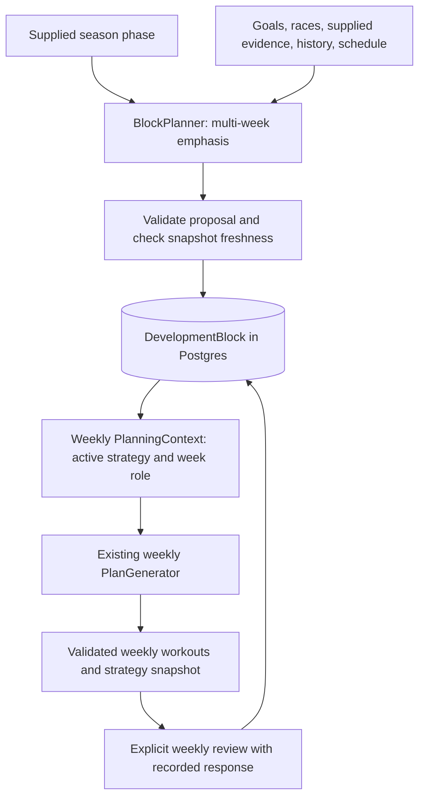

# Persistent development blocks

The subsequent [adaptive review checkpoint](adaptive-block-reviews.md) adds richer
review evidence, a guarded review service, and an opt-in OpenAI review evaluator.
It supersedes the foundation's review roadmap below. Terminal/uncovered blocks now
gate normal weekly generation until review/replacement; live review jobs remain deferred.

Implemented September 7, 2026. This document is the review guide and operating
checkpoint for the development-block foundation. It supplements the existing
[weekly OpenAI planner](openai-planner.md); it does not replace that architecture.

## Scope and initial audit

The working tree was clean at `2b64d0b` (`initial ai integration`). Existing code
already supplied race goals with independent importance/demand profiles, athlete
capabilities with cited evidence, goals, local availability, restrictions, feedback,
12-week training history, and a derived GENERAL_FITNESS/RACE_TARGETED objective.

Weekly generation already had a BullMQ job identified by its Postgres job-run ID,
short transactions under the athlete training lock, frozen context, bounded proposal
corrections, leases, and stale-input checks. Those mechanisms remain in place.

The incremental addition is two tables, shared strategic types, a local block
planner/service, append-only review records, and optional weekly strategy context.
No runtime dependency, service, new weekly job type, or paid block provider was added.

## Three timescales



Season phase describes broad intent. The block defines persistent capability
priorities and a flexible sequence of week roles. The weekly generator chooses
actual workouts. This milestone has no separate season-calendar engine: the
active block publishes its supplied broad phase as `PlanningContext.seasonPhase`.
A material phase change uses a replacement block. This avoids inventing an
automatic season policy while preserving the different strategic scopes.

## Domain and storage

| Concept | Representation and meaning |
| --- | --- |
| TrainingPhase | `GENERAL_PREPARATION`, `BUILD`, `RACE_SPECIFIC`, `TAPER`, `RECOVERY_TRANSITION` |
| DevelopmentBlock | Owned row with ID, local start/exclusive end dates, phase, status, revision, immutable proposal JSON, created/updated timestamps |
| Proposal | Version 1, start date, phase, focuses, week pattern, owned race IDs, rationale |
| DevelopmentFocus | Sport, existing controlled capability key, PRIMARY/SECONDARY/MAINTENANCE role, progression strategy, rationale |
| ProgressionStrategy | `VOLUME`, `LONG_SESSION`, `TIME_AT_INTENSITY`, `REPETITIONS`, `INTERVAL_DURATION`, `FREQUENCY`, `MAINTAIN` |
| BlockWeekRole | `DEVELOPMENT`, `RECOVERY`, `TAPER`, `RACE`, `RETURN` |
| BlockDecision | `PROGRESS`, `HOLD`, `RECOVER_EARLY`, `CONTINUE_RECOVERY`, `COMPLETE_BLOCK`, `REPLAN_BLOCK` |
| Block review | Append-only row tied to a block/revision; reviewed and effective weeks, explicit decision/rationale, optional future pattern, captured response |

Focuses reuse `CAPABILITIES` and `isCapability` from the athlete profile; there is
no second physiology taxonomy. At least one primary focus is required. Duplicate
sport/capability focuses are rejected. A maintenance role uses `MAINTAIN`.
Strategies are intent, not progression formulas or percentage prescriptions.

The migration `20260907000000_development_blocks` adds `DevelopmentBlock`,
`DevelopmentBlockReview`, and an ACTIVE/COMPLETED/ABORTED enum. Foreign keys retain
ownership. A partial unique index allows only one ACTIVE block per athlete.
Review revisions are unique within a block. Phase and decision text are checked
by shared schemas rather than introducing several additional database enums.

Ownership, lifecycle, dates, and review history are relational; nested focuses,
patterns, and response snapshots use JSON. Athlete/race facts remain in their
existing tables: blocks store race references, not copies of race goals.

Weeks start on local Mondays. `weekIndex` is **zero-based and derived** from the
target calendar week, so it does not require a weekly counter job. `plannedWeeks`
and exclusive `plannedEndDate` follow the original pattern plus recorded future
changes. A target outside the block has `weekIndex: null` and `weekRole: null`,
plus a review-needed note. An expired ACTIVE block is not silently repeated or
completed. The 52-week document bound and list bounds limit payload size; they
are not training limits.

## Block creation and persistence rules

`BlockPlanner.createBlock(context)` is asynchronous and separate from the weekly
`PlanProvider`. `createDevelopmentBlock` defaults to IF_NEEDED: it returns an
existing active block without another proposal, including an expired block awaiting
review. With no active block, it creates one. Explicit REPLAN requires the current
block ID/revision, preserves the previous proposal/reviews, marks that row ABORTED,
and creates a new row in the same transaction. Failed replanning leaves the old
active strategy intact. Completed blocks remain available as history.

The initial provider is **deterministic and guided**. Phase, rationale, and any
specific emphasis are supplied explicitly. It does not infer medical readiness,
weaknesses, race phases, or taper dates. This is deliberate: connecting another live
model is not necessary to verify the persistence and weekly integration foundation.

GENERAL_FITNESS can omit focuses. The fallback selects broad endurance development
for one enabled sport and maintenance for the others, rotating the primary sport
from the most recent block. That rotation is scaffolding, not a physiological
assessment or an automatic decision that a completed block succeeded. Explicit
focuses can instead specify supplied weaknesses, threshold work, or a different
maintenance/development balance. Zero-goal sports are excluded.

RACE_TARGETED requires explicit focuses with this provider. Its context contains
all upcoming races and events from the last 28 days for transition context, with
dates, importance, and supplied demands. Multiple races retain independent IDs
and importance values; no priority-to-volume formula is applied. Taper and race
week roles require a real referenced event. The provider does not invent missing
race demands. Phase is supplied rather than selected by a fixed number of weeks
before a race. General-fitness blocks may use different supplied phases over time;
they are not forced into permanent race-style base training.

Block context includes goals, supplied capability/evidence data, recent and
established training summaries, current strategy, three recent block proposals,
recurring/near-term availability, future date overrides, restrictions, adjustments,
and data-quality notes. It excludes raw streams, credentials, full activity records,
and the complete workout archive.

The service captures inputs under the existing athlete lock, calls the provider
outside the transaction, then reacquires the lock and compares fresh inputs with
the snapshot. It rejects stale strategies, changed races/profiles/schedules, a local
date rollover, or unfinished sync. A provider receives a clone and cannot redefine
the validation snapshot. No pending generation can overwrite a newer block.

## Reviews and adaptive week roles

Reviews record **supplied decisions**, not automatic analysis of comments or PRs.
The service captures sport-level planned minutes/session counts, completed-activity
minutes/frequency/longest sessions, reported plan completion, recent feedback/RPE,
references to known performance evidence, and restrictions/availability at review.
Actual activity and reported plan completion stay separate. No automatic matching
or measured interval-execution assessment is claimed.

Completed-week metrics use the existing 12-week history. Feedback is bounded to
four recent weeks and 20 entries per response, with truncation indicated. Reviewing
an in-progress or older week may leave activity summaries null; notes explain this.
Comments and the decision rationale are stored literally. A high RPE or missed
workout does not automatically lower a baseline or abort a block.

| Decision | Service behavior |
| --- | --- |
| PROGRESS | Record targeted progression guidance; do not apply a numeric formula |
| HOLD | Record a hold without automatically reducing baselines or goals |
| RECOVER_EARLY | Require a future pattern starting with RECOVERY |
| CONTINUE_RECOVERY | Require a reviewed recovery week and a future pattern starting with RECOVERY; allow extension |
| COMPLETE_BLOCK | Record completion and mark the block COMPLETED; permit a subsequent block |
| REPLAN_BLOCK | Record the changed assumptions and mark ABORTED; a separate creation selects the replacement |

The optional `remainingWeekPattern` replaces the tail from `effectiveWeekStart`.
Earlier roles and the original proposal remain unchanged. Effective weeks cannot
precede the current week or previous review effects. A reviewed week must belong
to the block and cannot be in the future. Nonterminal extensions cannot create
gaps. Terminal reviews can close long-expired blocks without extending them.

`[DEVELOPMENT, DEVELOPMENT, DEVELOPMENT, RECOVERY]` is a default only. Explicit
patterns support 2+1, 4+1, early/extended recovery, return, taper, and race weeks.
An explicit taper phase defaults to one TAPER role and recovery/transition to one
RECOVERY role; the supplied pattern can change those choices. There is no modulo
four calculation, universal deload percentage, or automatic progression because
the calendar has advanced. PROGRESS at an ended block needs an explicit extension
or completion/replanning rather than a silently invented next week.

## Weekly planner integration

`buildPlanningContext` adds nullable `seasonPhase` and `developmentBlock`. The latter
contains ID/revision, phase, dates, derived index/length/role, focuses, race IDs,
rationale, and the most recent applicable review. Legacy snapshots default both
new fields to null; weekly generation still works without a block.

`buildOpenAIPlanningInput` passes that strategy and identifiable races. Stable
instructions make the block the weekly strategic direction, distinguish key,
supporting, and maintenance work, and guide the smallest useful targeted progression
when response evidence warrants it. Continuity is a default, not an instruction to
repeat an unchanged stimulus forever. An old PROGRESS review is not perpetual
permission to increase. Hard constraints and protected workouts take precedence.

RECOVERY prepares for future development by dissipating fatigue while retaining
useful exposure. TAPER prepares for a specific race with appropriate sharpness.
Neither uses universal scaling. RETURN uses history without assuming immediate
full-workload tolerance. Saved time goals remain desired weekly training; material
departures still need contextual justification. Minimum effective dose means enough
useful stimulus without unnecessary excess, not always prescribing less.

The existing finalizer stores the server-supplied strategy in the v2 weekly plan.
Historical saved weeks therefore retain their strategy even after a block changes.
A remaining-week regeneration records its newly used strategy at **plan level**;
per-workout strategy revision history within a partially regenerated week is not
added here. Protected workout contents remain governed by the existing validator.

Existing job freshness checks compare the extended context automatically, so block
creation/review/replacement cancels an older in-flight weekly result. No changes to
the BullMQ protocol or weekly job runner were needed. The existing deterministic
weekly fallback remains functional; the new coaching instructions affect the
OpenAI weekly provider. Local evaluations verify contracts, not coaching quality.

## Use locally

The migration was applied to the local application database. No real athlete block
was created and no goal/plan was changed. Restart running web/worker processes to
load the rebuilt packages and prompt. On another checkout/deployment run:

```powershell
npm run db:generate
npm run db:deploy
npm run build
```

Local administrative commands use `.env` for Postgres and always select the local
block provider. They are not public HTTP endpoints. Use the actual athlete ID and
choose the current or a future Monday:

```powershell
npm run blocks -- show 1
npm run blocks -- preview 1 path/to/block-request.json
npm run blocks -- create 1 path/to/block-request.json
```

Example request (replace dates as appropriate):

```json
{
  "startDate": "2026-09-14",
  "phase": "BUILD",
  "rationale": "Develop run durability while maintaining bike threshold.",
  "raceIds": [],
  "weekPattern": ["DEVELOPMENT", "DEVELOPMENT", "RECOVERY"],
  "focuses": [
    { "sport": "RUN", "capability": "LONG_ENDURANCE", "role": "PRIMARY", "progressionStrategy": "LONG_SESSION", "rationale": "Explicit run durability emphasis." },
    { "sport": "BIKE", "capability": "THRESHOLD", "role": "MAINTENANCE", "progressionStrategy": "MAINTAIN", "rationale": "Preserve useful cycling stimulus." }
  ]
}
```

For a review, use `npm run blocks -- review 1 path/to/review.json`:

```json
{
  "blockId": 1,
  "expectedRevision": 1,
  "review": {
    "reviewedWeekStart": "2026-09-14",
    "effectiveWeekStart": "2026-09-21",
    "decision": "RECOVER_EARLY",
    "rationale": "The athlete explicitly requested recovery after a difficult week.",
    "remainingWeekPattern": ["RECOVERY", "RETURN"]
  }
}
```

For `replan`, use a file with `{ "expectedBlock": { "id": 1, "revision": 2 },
"direction": { ...the new block request... } }`. Run `show` to obtain current IDs
and revisions. Review/create commands do not generate weekly workouts: use the
existing Generate Plan action afterward. Future web callers must derive ownership
from the authenticated session and send provider work through the worker.

## Validation and fixtures

- All 173 existing tests passed; all 22 block tests passed (195 total).
- Prisma validation, generated client, disposable migration deployment, local
  migration deployment/status, workspace typechecks, lint, and production build passed.
- All 20 existing free weekly evaluations and all 18 free block fixtures passed.
- No paid OpenAI calls, live Strava calls, or production deployment were performed.
- Windows `tsx` needed execution outside the sandbox to read OS user information;
  integration tests still used the existing disposable-database harness.

```powershell
npm run test:blocks
npm run evaluate:blocks
npm run evaluate:planner
```

The block fixtures cover stable general fitness, supplied run-development need,
progress, hold, early recovery, illness/travel return, far/build/specific/taper race
contexts, post-race transition, competing races, new-race and restriction replans,
missing evidence, maintenance of a supplied strength, recovery with unchanged
goals, and completion followed by another emphasis. Phase/decision inputs are
explicit, so these fixtures do not falsely claim to test automatic phase or
readiness inference. Assertions check schema/context/history invariants rather
than requiring one exact workout plan.

## File review map

| File | Responsibility | Review focus |
| --- | --- | --- |
| [development-block.ts](../packages/shared/src/development-block.ts) | Phases, focuses, patterns, decisions, review responses, block projection | Date/index semantics; immutable history; technical bounds |
| [block-planning.ts](../packages/shared/src/block-planning.ts) | Strategic context, BlockPlanner contract, guided local provider, validation | Explicit vs inferred inputs; general-fitness fallback; real race references |
| [development-blocks.ts](../packages/db/src/development-blocks.ts) | Owned reads, context assembly, create/replan/review services | **Start here:** transaction boundaries, optimistic revisions, lifecycle, response capture |
| [schema.prisma](../packages/db/prisma/schema.prisma) | Two persistent models and status enum | Relational ownership/history versus nested JSON |
| [migration.sql](../packages/db/prisma/migrations/20260907000000_development_blocks/migration.sql) | Additive tables, constraints, one-active-block index | PostgreSQL uniqueness and foreign keys |
| [DB planning-context.ts](../packages/db/src/planning-context.ts) | Adds active strategy to weekly reads | Snapshot consistency and uncovered-week note |
| [shared planning-context.ts](../packages/shared/src/planning-context.ts) | Optional strategy input and calendar consistency | Legacy defaults and phase/index consistency |
| [plan-generation.ts](../packages/shared/src/plan-generation.ts) | Attaches server-supplied strategy to validated plans | No weakening of protected-workout/hard validation |
| [structured-workouts.ts](../packages/shared/src/structured-workouts.ts) | Optional v2 plan strategy provenance | Old plans remain readable |
| [planner-prompt.ts](../apps/worker/src/planner-prompt.ts) | Weekly strategic instructions and compact payload | **Review coaching behavior:** roles, progression, recovery/taper, desired goals |
| [shared index.ts](../packages/shared/src/index.ts), [DB index.ts](../packages/db/src/index.ts) | Package exports | Architecture boundaries |
| [manage-blocks.mjs](../scripts/manage-blocks.mjs) | Local show/preview/create/replan/review command | Explicit writes, revision inputs, no paid provider |
| [evaluate-blocks.mjs](../scripts/evaluate-blocks.mjs) | Local strategy/context evaluation | Honest distinction between supplied decisions and inference |
| [block-scenarios.mjs](../tests/fixtures/block-scenarios.mjs) | Eighteen synthetic strategic scenarios | Representative context; no exact-block oracle |
| [development-blocks.test.mjs](../tests/development-blocks.test.mjs) | Focused unit/integration coverage | Concurrency, ownership, historical immutability, weekly cancellation |
| [test-strava.mjs](../scripts/test-strava.mjs), [package.json](../package.json) | Register block tests and local commands | Existing isolated harness reused |
| [README](../README.md), [design](design.md), [review guide](code-review.md), [status](mvp-status.md), this document | Entry points and checkpoint | Intended scope and remaining work |

## Deliberate limits and next checkpoint

The repository had no season planner or review inference engine. This foundation
therefore uses supplied phase/focus/review decisions and a local command instead
of introducing an automatic AI caller or new UI flow. Week position is derived,
matching existing local-date planning; optional context fields preserve old snapshots.

Automatic block need detection/reviews, autonomous race-phase/focus selection,
live OpenAIBlockPlanner, background scheduling, review/revision UI, and a complete
season calendar remain deferred. So do PR extraction, power-duration curves,
strength/weakness scoring, baseline updates, raw-stream analysis, physiological
load models, comment interpretation, medical diagnosis, weather/calendar services,
workout editing, detailed taper optimization, and universal training rules.

**Next checkpoint:** review the domain/service/prompt files above; preview and
explicitly save a real athlete block; inspect the exact weekly payload and the
next plan under that strategy. Only after agreeing on phase selection, review
authority, out-of-block behavior, and replacement timing should an independently
configured live BlockPlanner be attached through worker jobs with bounded retries,
cost controls, and the existing freshness contract. Paid coaching-quality evaluation
requires separate explicit authorization.
