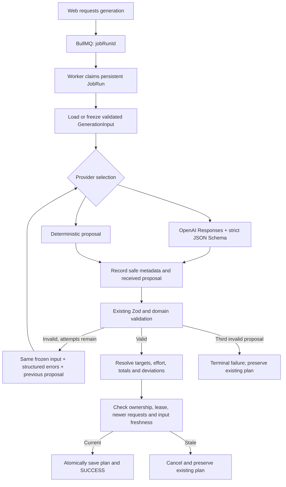

# First OpenAI planner integration

See [review evidence and focus guidance](block-review-focus-guidance.md) for the
latest review Structured Outputs schema, evidence-attribution instructions, and
weekly focus-action semantics. The provider/model and live opt-in behavior are unchanged.

The [adaptive block-review checkpoint](adaptive-block-reviews.md) adds a separate
reviewer and opt-in evaluation command. Weekly and review providers share the
existing Responses transport. The weekly prompt now discourages duration padding,
requires accurate intensity titles, and explains PROGRESS/HOLD/recovery semantics.
Production live review jobs remain deferred; local review persistence is available.

This checkpoint connects a real provider to the existing planner contract. The worker
uses the official OpenAI Node SDK and Responses API with Structured Outputs. The
default remains deterministic. Initial implementation checks used mocked calls. The user
subsequently reported a successful live `normal-build` response, including schema/domain
validation and resolved FTP targets, but identified unjustified volume and inconsistent
explanations. The prompt follow-up below addresses those findings; its live quality
still needs to be checked. No paid calls were made during this follow-up.

## Audit and scope

### Coaching philosophy and objective follow-up

The context already supplied race dates/importance/demands, manual baselines,
capabilities/evidence and feedback. Race relevance was already defined by the DB
builder as a date on or after the athlete's current local date, including race day
and zero-importance goals. There was no explicit objective and all original 18
evaluation fixtures had a race.

`PlanningContext` now includes shared `planningObjective: { mode: "RACE_TARGETED" |
"GENERAL_FITNESS" }`. The shared context parser derives it from relevant races using
`generatedAt` in the athlete's timezone. Since the DB builder already parses every
context through that schema, construction and worker serialization use the same
derivation. A future/current race selects RACE_TARGETED; no such race selects
GENERAL_FITNESS. There is no additional relevance horizon, importance cutoff or UI
setting. An event before the target week but still current/future at generation time
follows the existing rule; the mode is not a prediction of training phase.

The property is optional on input for old snapshots and always present on parsed
output. Any supplied value is replaced by the derived one so it cannot become an
independent source of truth. Older pending snapshots normalize in memory before
freshness comparison and can retry. The mode may appear in existing snapshot JSON,
but no independently persisted column or database migration was added. Proposal and
saved-plan schemas are unchanged.

Stable prompt additions explicitly define minimum effective dose as **enough stimulus
for the intended adaptation without low-value excess**, not always less training.
Weekly time goals are desired training, not availability ceilings. Material undershooting
needs contextual justification just as overshooting does. Continuity remains the default
when targets/history align. Easy support can be valuable; neither efficiency nor the lack
of a race is a reason to automatically reduce volume or prescribe only easy work.

The coaching additions cover:

- Integrated swim/bike/run planning, cumulative fatigue and effects on subsequent sessions.
- Internal key/support/optional priorities. Only genuinely optional work uses the existing
  `optional` flag; no session-category schema or UI was introduced.
- Preserving the intended stimulus when adjusting intervals, including adequate recovery
  when effort quality depends on it, without a fixed work:recovery ratio.
- Most relevant supplied evidence, within existing relative-target metrics and baseline
  resolution; no new performance estimates, target metrics, benchmarks or inferred baselines.
- Contextual interpretation of poor performance and uncertainty, without inventing causes,
  medical conclusions or automatically lowering targets after one failed workout.
- Evidence-supported maintenance of strengths and goal-relative developmental emphasis.
- GENERAL_FITNESS development: durable endurance, technique and appropriate threshold/higher
  intensity stimulus within goals/constraints, without fabricated races, demands or peak dates.
- Environmental flexibility only when actual conditions and equipment are supplied; no weather API.

The hierarchy now has eight priorities, inserting highest-value training stimuli after
capabilities relevant to the current objective. Hard constraints, protected work and
adjusted targets/continuity retain precedence. Coaching heuristics and PlanningDeviations
remain nonfatal unless a real hard constraint is violated. No new correction loop was added.

Two synthetic scenarios extend the original 18:

- `general-fitness`: no races, realistic goals/history and a cycling baseline; unknown
  capabilities stay unknown, and generation remains valid.
- `asymmetric-evidence`: supplied synthetic bike/run assessments with cited observations
  support maintenance versus developmental emphasis. Scores are test inputs, not a new
  inference method or population percentile. Manual baselines remain unchanged.

To intentionally evaluate only the no-race scenario (paid):

```powershell
npm run evaluate:planner:openai -- --scenario general-fitness *> general-fitness.log
```

Use `--scenario normal-build` for comparison with previous runs, or
`--scenario asymmetric-evidence` to inspect evidence-based emphasis. No live call was
made for this follow-up; mock tests cannot establish actual coaching quality.

### Original integration audit

The starting tree was clean at `2aa3f5b` (`improved infra`). The existing `PlanProvider`
contract already accepted a validated `GenerationInput` and correction attempt/errors.
`generatePlanWithCorrections` bounded domain corrections to three proposals. Persistent
`JobRun` requests froze inputs, checked snapshot freshness, and atomically saved the
plan and success state after generation outside a transaction.

The fixed two-minute lease could expire across several real provider calls. It is now
renewed while the worker owns the attempt. Existing `JobRun.planRequest` JSON holds
call metadata and cached proposals; no database migration was needed. The existing
18-scenario evaluator now accepts an explicit live-provider command.

The web/worker split, queue payload, authoritative validation, context builder,
deterministic generator, and hard/soft rule distinction remain in place. This change
does not implement inference, automatic PR/baseline updates, new race-demand profiles,
feedback interpretation, model escalation, or a new UI.

## Execution flow



The adapter implements `PlanProvider`; it does not add another generator interface.
The worker initializes it lazily inside job execution, so missing credentials become
a useful failed job rather than crashing worker startup. Each execution gets its own
adapter; there is no shared athlete chat, remote conversation, or previous-response ID.

## Configure and run

Use Node.js 24, as in the verified local setup. The installed SDK requires Node.js
22 or newer; keep the existing Prisma/Next runtime requirements in mind when deploying.

From the repository root, copy `apps/worker/.env.example` to
`apps/worker/.env.local` **if that file does not already exist**. Otherwise add the
settings below to the existing file. It is ignored by Git. Add your own key privately;
never put it in `apps/web/.env.local`, `NEXT_PUBLIC_*`, source, or the shared root `.env`.
Deployed workers should receive the key through their private service environment.

| Variable | Default | Meaning |
| --- | --- | --- |
| `PLANNER_PROVIDER` | `deterministic` | Set `openai` to enable paid worker generation. |
| `OPENAI_API_KEY` | unset | Required only when selecting OpenAI. |
| `OPENAI_PLANNER_MODEL` | `gpt-5.6-luna` | Configurable model; must support Responses Structured Outputs. |
| `OPENAI_PLANNER_TIMEOUT_MS` | `75000` | Per-call timeout; accepted range 1,000–90,000 ms. |
| `OPENAI_PLANNER_MAX_OUTPUT_TOKENS` | `16000` | Per-call output budget; accepted range 1,000–32,000 tokens. |

The worker reads its `.env.local` before the root infrastructure `.env`. Existing
process environment variables take precedence. The evaluator reads only the worker
file for AI settings. No code path automatically falls back to another model.

For one real generation:

1. Set the worker key and `PLANNER_PROVIDER=openai`; start Postgres and Redis.
2. Run `npm run dev` (or restart the separately deployed worker).
3. Sign into the web app, check goals/availability/baselines, and request next-week
   generation with the existing calendar control. This can make paid calls.
4. Wait for success; inspect workout details, totals, and explanations in the calendar.
   A failed or stale request leaves the existing plan intact. Existing automatic
   generation triggers also use the selected provider, so enabling OpenAI applies to
   every generation job that worker executes.
5. Inspect the `planner.provider_call` worker log and persisted request metadata.
   Switch back to `PLANNER_PROVIDER=deterministic` and restart to stop future AI calls.

To evaluate **one synthetic scenario** before running all 20:

```powershell
npm run evaluate:planner:openai -- --scenario normal-build
```

To run the **20-scenario live evaluation**:

```powershell
npm run evaluate:planner:openai
```

Both commands incur API usage and require an explicitly configured key. They use
synthetic fixtures, do not write plans to the database, and allow up to three proposal
calls per scenario (up to 60 calls for all 20). Transport failures fail that evaluation
scenario rather than starting BullMQ infrastructure retries. The command exits nonzero
if any scenario fails. An incomplete response is a failure even if its partial text
looks plausible; inspect the budget before explicitly retrying.

These commands remain free and do not contact OpenAI, including when the worker is
configured for OpenAI:

```powershell
npm run evaluate:planner
npm run test:openai
```

The default evaluator never initializes the SDK. Integration test harnesses force
deterministic mode and clear any inherited key; OpenAI tests inject a fake network
transport into the real SDK.

## Input and output boundaries

`planner-prompt.ts` separates stable instructions from serialized planning data.
The dynamic object is deliberately built from a validated `GenerationInput`, with:

- Target week, replacement start, timezone, goals, and adjusted targets.
- Date-resolved availability, pool access, shared daily minutes/session limits,
  restrictions, and dated volume/intensity adjustments.
- Effective fitness baselines and zones, recorded performance profile, missing-data
  notes, recent training, and twelve-week history.
- Current race demands/importance and recorded athlete feedback.
- Protected workouts, current target-week workouts, and previous planning analysis.

It does not pass raw Prisma objects, database/Strava/OpenAI credentials, raw activity
streams, unrelated athletes, or an internal athlete ID. Workout/evidence references
needed by the planner may remain in planning data. Free text is explicitly treated as
untrusted data, not permission to change constraints or instructions. This reduces
prompt-injection risk; deterministic validation remains the actual enforcement boundary.

The instructions delegate session frequency, placement, workout design, recovery,
relative intensity, progression, and race tradeoffs. Goals remain immutable. Positive
minute goals are targets; a zero sport goal excludes new workouts for that sport.
Hard-session clusters and progression differences are considerations, not universal
prohibitions. Race importance scores are independent preferences, not volume shares.
The model must explain meaningful tradeoffs and cannot infer weaknesses from absent data.

The SDK's `zodTextFormat` generates a strict JSON Schema from a wire form of the shared
proposal/workout schemas. The wire form omits server-owned `resolved` values and replaces
Zod transformations/refinements that JSON Schema cannot express. It retains the shared
fields, numeric bounds, sport/target enums, repeated blocks, and segment structure.
The response is JSON-parsed and then passed to the **unchanged authoritative domain
validator**, including cross-field duration arithmetic, sport/target compatibility,
available baselines, protected IDs, dates, and daily limits. Server code resolves
watts/pace, reclassifies effort, and calculates totals and deviations.

The provider cannot submit saved goals, server-calculated analysis, or plan provenance.
The installed plan's optional `generation` metadata is added by the server. Old plans
remain readable without that field.

The API choices follow the official [Structured Outputs guide](https://developers.openai.com/api/docs/guides/structured-outputs)
and configurable default [model documentation](https://developers.openai.com/api/docs/models/gpt-5.6-luna).
Broader live scenario acceptance and plan quality still need evaluation in your account.

## September 7 prompt-quality follow-up

The latest revision adopts the user's proposed sectioned prompt: decision priority,
top-down design, continuity, minimum sufficient deviation, session purpose, hard/soft
rules, history, races, intensity, structure, final audit, explanations, untrusted input,
and corrections. It retains the derived-summary definition and explicitly preserves
immutable goals and the soft status of coaching priorities. Strength/weakness labels
require supplied evidence; absent evidence stays unknown. The draft's duration equation
was corrected to sum repeated segment seconds against `durationMinutes * 60`, matching
the existing validator. Exact recovery hours remain unknown under date-only scheduling.
No schema, validator, model selection, or data-serialization behavior changed in this
wording revision. Prompt assertions now normalize whitespace so formatting does not
break policy checks. Live quality remains unverified for the new wording.

The later top-down planning refinement retains the fixes below and organizes stable
instructions into seven ordered priorities: hard user/system constraints; protected
training; adjusted targets and continuity; race capabilities; purposeful workouts;
progression/intensity/recovery; available capacity. Lower priorities cannot override
higher ones. The coaching priorities remain soft objectives, with contextual exceptions.

The internal design order is now explicit: account for protected work, choose sport
frequency, choose key stimuli and long/endurance work, add purposeful easy support,
distribute target volume, then add interval detail and audit the finished week.
Continuity is preferred when targets/history align. More frequency does not justify
more volume: redistribute the existing target unless extra volume has independent
support. Among similarly useful plans, prefer the smallest necessary departure from
targets, volume history, frequency and longest sessions. Larger departures need stronger
and more specific evidence. Sessions must serve a purpose beyond filling days or variety.

Dynamic input now includes `sportPlanningSummary` for RUN/BIKE/SWIM, derived each time
from the validated frozen input. It puts saved/adjusted minutes, protected minutes/counts,
previous-week minutes/counts/longest session, and established minutes/counts/longest
session plus sample count side by side. The normal-build run summary is:

```json
{
  "savedGoalMinutes": 120,
  "adjustedTargetMinutes": 120,
  "protectedMinutes": 0,
  "protectedSessions": 0,
  "previousWeekMinutes": 120,
  "previousWeekSessions": 2,
  "previousWeekLongestMinutes": 60,
  "establishedMinutes": 120,
  "establishedSessions": 2,
  "establishedLongestMinutes": 60,
  "establishedSampleWeeks": 3
}
```

The existing established-volume calculation was extracted to a shared helper: median
of up to three highest nonzero-volume weeks in the twelve-week window. Sessions and
longest duration use medians from those same weeks; volume ties use input history order,
newest first. The deviation report reuses this helper without changing its numeric
behavior. These comparisons are descriptive recorded evidence, not inferred tolerance.
Missing established history produces null values and zero sample weeks. Recorded zero
weeks remain zero, with existing ingestion caveats. For older snapshots without the
twelve-week history, previous-week minutes/counts use the recent training summary;
the unavailable longest-session/established measurements stay null.

The earlier top-down refinement added no shared input/output schema, database field
or migration. The comparison
is a disposable projection for the model, not separately persisted state. Stable policy
stays in Responses `instructions`; athlete data stays in `input`. Structured Outputs,
hard validation, descriptive deviations and the correction architecture remain authoritative.

The reported run increased the run goal/history from 120 to 180 minutes without a
compelling explanation, described a 60-minute run after a two-hour ride as a short
transition, and contradicted its own final run count. These are coaching/prompt issues,
not reasons to turn soft measurements into universal rejection rules.

The stable instructions now:

- Treat weekly goals as strong targets while allowing small coherent differences.
- Require concrete supplied context for material departures from goals/history, and
  ask for revision toward the targets when no justification exists.
- State that availability is capacity, never a target to fill.
- Request an internal final-week review of sport minutes/counts, goals/adjustments,
  recent/established history, frequency, longest sessions, and hard-session distribution.
  Protected workouts count once; replaced old workouts do not count.
- Require titles, durations, session-count claims, and explanations to agree with the
  final plan. Long bricks remain possible but must be described and justified honestly.
- Use the existing short plan-level `explanation` for meaningful tradeoffs and departures.
  No hidden reasoning or model-authored authoritative total fields are requested.

No schema, migration, validator behavior, deviation formula, or correction-loop change
was needed. Large soft deviations still validate and are measured. There is no new universal
progression percentage, exact-goal equality, brick-duration cap, or hard-session density/
spacing rule. A future review using calculated deviations is deferred; this change adds
no automatic quality rejection or extra API call.

## Corrections, timeout, and ownership

| Condition | Behavior |
| --- | --- |
| Valid proposal | Finalize through shared validation; save only while current. |
| Invalid structure/domain constraints or malformed/empty JSON | Existing correction loop receives original frozen input, previous proposal, and code/path/message/workout-ID errors. Three total proposals, not three extra retries. |
| Third invalid proposal | Terminal failure with validation reason; existing plan preserved. |
| Refusal | Terminal failure; do not repeatedly prompt past the refusal. |
| Incomplete response | Terminal failure; user can review request/output budget. |
| Missing key, unknown provider, authentication or invalid API configuration | Terminal configuration failure with a safe message. |
| Timeout, connection error, HTTP 408/409/429/5xx | Infrastructure retry, separate from domain corrections. |
| Superseded request or changed planning input | Abort on next freshness check; final stale guard always applies. |

SDK retries are disabled both on the client and individual requests. An explicit
AbortController and SDK timeout bound each call to 75 seconds by default. Combined
signals also allow cancellation when the database request becomes stale.

The database lease lasts 120 seconds and is renewed every 20 seconds, plus immediately
before each proposal attempt. Renewal is a short transaction guarded by request
status, attempt number, unexpired ownership, and frozen-input freshness. No transaction
spans an API call. Heartbeats do not overlap. A failed renewal aborts the provider;
an expired owner cannot renew itself or overwrite a recovered attempt. Final persistence
still independently checks all guards and atomically updates plan and job status.

The existing infrastructure limit is three executions. Database retry delays start at
2 seconds and then 4 seconds; HTTP `Retry-After` may extend those delays, capped at five
minutes. BullMQ/recovery respects persisted `nextRetryAt` and lease expiry. These short
delays are separate from the 20-second heartbeat and the 75-second call timeout.
Cancellation detection is normally within a heartbeat interval plus database latency;
it is not instantaneous. A late response still cannot install a stale plan.

## Durable results and duplicate execution

`JobRun.planRequest.providerExecution` contains bounded call metadata and up to three
serialized proposals indexed by proposal attempt. Received invalid proposals are also
cached, allowing validation to replay consistently and advance to the same correction
number on infrastructure retry. An execution reloads the frozen snapshot and durable
proposals before requesting missing results. This avoids another paid call when a
proposal was recorded but the later atomic plan save failed.

Active duplicate deliveries defer to the lease. Successful duplicate deliveries return
the existing result. Attempts and final writes are guarded, so external duplicates cannot
create competing installed plans. Do not change model/provider configuration during a
pending request if you want consistent model evaluation; recorded proposals retain their
original model metadata and may be reused after a worker restart.

This is **not exactly-once external execution**. A remote response may finish while the
connection fails, the process dies, or local metadata/proposal persistence fails. If no
usable proposal was durably recorded, a retry may make another paid call. `store:false`
is sent; this implementation does not retrieve remote conversations or reconcile an
ambiguous response. Cancellation cannot guarantee zero billing for work already started.
Database outages can also prevent metadata persistence; safe console records are emitted
before that write. The three infrastructure attempts and three proposal positions bound
execution to at most nine SDK calls per job under these policies.

## Telemetry and evaluation review

Each call records provider, actual model, response ID when received, proposal attempt,
infrastructure attempt (jobs only), elapsed milliseconds, input/cached-input/output/total
tokens when reported, and a categorized result. Missing usage stays null, not zero.
`RESPONSE` means usable wire-shaped JSON was received; domain validity and final success
are tracked by corrections and the job state. A schema-valid response can still fail
hard-constraint validation.

Metadata is persisted under `JobRun.planRequest.providerExecution.calls` and logged as
`planner.provider_call` JSON without prompts, keys, or raw SDK errors. Cached proposals
remain private in the same database JSON. `WeeklyPlan.content.generation` links a saved
AI plan to provider/model/response/request. No telemetry migration or UI was added.

For a request selected in Prisma Studio, inspect its status, error, attemptsStarted,
planRequest snapshot, calls, and proposals. To inspect only safe metadata via SQL:

```sql
SELECT id, status, "attemptsStarted", error,
       "planRequest"->'providerExecution'->'calls' AS provider_calls
FROM "JobRun"
WHERE "jobType" = 'COMPUTE_PLAN'
ORDER BY id DESC LIMIT 10;
```

For reported usage, estimate cost per call as:

```text
((inputTokens - cachedInputTokens) * inputPricePerMillion
 + cachedInputTokens * cachedInputPricePerMillion
 + outputTokens * outputPricePerMillion) / 1,000,000
```

Use current prices for the recorded model. Do not treat missing usage as a free call;
the provider billing record is authoritative for ambiguous failures. No price table is
hardcoded because model selection and pricing can change.

Evaluator JSON includes scenario ID/description, model, validity, proposal attempts,
call records, aggregate token usage, elapsed time, calculated deviations, sport totals,
and the generated plan. Review coherence, relative intensities, availability use,
preserved workouts, missing-baseline handling, and race tradeoffs. There is intentionally
no single exact expected plan for each scenario. Passing validators does not establish
training quality or validate the prompt's resistance to every adversarial input.

A readable summary for each scenario now appears on stderr before the full JSON is
written to stdout. It shows scenario, model, proposal attempts, actual provider-call
count, total scenario latency, response IDs in call order, aggregate input/cached-input/
output/total tokens, and PASS/FAIL. Missing usage is explicitly `unknown`, including
partial aggregate usage; zero reported cached tokens remains zero. The detailed JSON
retains each call's usage and latency. JSON output can still be redirected separately
without losing the terminal summary. No prices, prompts, or credentials are added to
the summary. PASS means schema/domain validation, not a quality verdict.

After reviewing the prompt follow-up, intentionally rerun only:

```powershell
npm run evaluate:planner:openai -- --scenario normal-build
```

Compare the actual final totals/counts, brick durations, and rationale with the earlier
run before deciding whether to run all 20 paid scenarios.

## File map and review priorities

| File | Implements / review focus |
| --- | --- |
| `apps/worker/src/openai-planner.ts` | SDK call, strict wire schema, safe response/error classification, timeout and metadata. **High priority.** |
| `apps/worker/src/planner-prompt.ts` | Stable instructions and compact private planning payload. **High priority: training intent and data scope.** |
| `apps/worker/src/planner-config.ts` | Provider/model selection and bounded timeout/output configuration. |
| `apps/worker/src/plan-provider.ts` | Lazy selection through the existing provider contract. |
| `apps/worker/src/processor.ts` | Routes generation jobs through the selected provider. |
| `apps/worker/src/index.ts` | Loads the private worker environment before infrastructure defaults. |
| `packages/db/src/plan-jobs.ts` | Renewable leases, cancellation, cached proposals, metadata, guarded atomic installation and infrastructure retry. **High priority: concurrency and failure behavior.** |
| `packages/shared/src/plan-generation.ts` | Adds cancellation, prior proposal, and telemetry callback to the existing correction contract. |
| `packages/shared/src/planning-history.ts` | Shared established-history summary for consistent prompt/report comparisons. |
| `packages/shared/src/planning-deviations.ts` | Reuses established-history helper; existing descriptive formulas/behavior preserved. |
| `packages/shared/src/planning-context.ts` | Shared derived planning objective, including normalization of older snapshots. |
| `tests/fixtures/planning-scenarios.mjs` | Adds no-race and supplied-asymmetric-evidence scenarios. |
| `tests/planning-context.test.mjs`, `tests/planning-semantics.test.mjs` | Objective date-boundary tests and full fixture validation. |
| `packages/shared/src/provider-call.ts` | Provider error/category, bounded metadata/cache, and provenance contracts. |
| `packages/shared/src/queue.ts` | Central lease and heartbeat constants. |
| `packages/shared/src/structured-workouts.ts` | Optional server-owned generation provenance on saved v2 plans. |
| `packages/shared/src/index.ts` | Exports provider-independent contracts. |
| `scripts/evaluate-planner.mjs` | Free default evaluator, explicit paid mode, scenario filtering and measurements. |
| `scripts/test-strava.mjs` | Registers mocked provider suite; prevents inherited paid configuration in tests. |
| `tests/openai-planner.test.mjs` | Real SDK with fake fetch, correction/error/metadata tests and real disposable-DB concurrency/persistence checks. |
| `apps/worker/package.json`, `package-lock.json` | Worker-only OpenAI SDK and direct Zod dependency. |
| `package.json` | Mock test and explicit live-evaluation scripts. |
| `apps/worker/.env.example`, `.env.example` | Nonsecret defaults and worker-only key placement. |
| `README.md`, `docs/ai-readiness.md`, `docs/mvp-status.md`, this document | Setup, checkpoint status, behavior and review instructions. |

Generated `dist` files are build outputs; review the TypeScript sources instead.

## Verification checklist

- [x] Mocked API tests, including correction exhaustion, timeout, transport failure,
  refusal/incomplete responses, missing key, deterministic selection, safe metadata,
  preserving an existing plan, durable response reuse, duplicate execution and cancellation.
- [x] All 173 automated tests: 169 tests across the eleven disposable-database suites
  (including 25 OpenAI tests), plus four ping-route tests. Five first-follow-up tests cover
  prompt policy/input preservation, soft-deviation acceptance, readable telemetry,
  and free CLI evaluation with separately parseable JSON output.
- [x] Top-down priority/order assertions and three derived-summary tests cover aligned
  history, protected/adjusted targets, sparse/missing history, and deviation-report parity.
- [x] Workspace TypeScript checks, lint, and production builds for shared/db/worker/web.
- [x] Objective tests cover no races, past/current/future races, local-date boundaries,
  zero-importance races, derived-mode precedence, legacy retries, and dynamic evidence.
- [x] All 20 local evaluation scenarios passed; no key or paid calls required.
- [x] `git diff --check`; private worker env is ignored and SDK imports stay out of web/shared/db.
- [x] User reported technical success for the first live `normal-build` scenario.
- [ ] User reruns `normal-build` with the revised prompt, reviews quality, and then
  decides whether to proceed with live calendar generation and the full paid suite.

The implementation stops here for review. The final live check is intentionally left
to the user after configuring credentials and accepting API usage.
# Percentage targets and block-aware evaluation

See the [September 7 unit audit and regression report](planner-target-units.md)
for percentage-point validation, per-attempt errors, and the separate
`general-fitness-active-block` scenario. The generic `general-fitness` fixture
continues to test no-block behavior.
