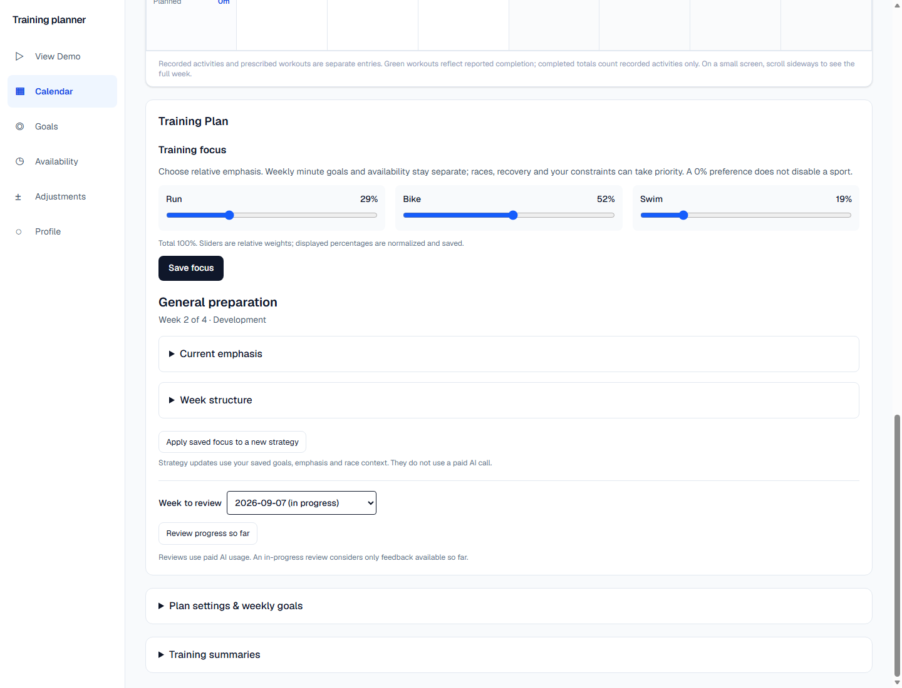
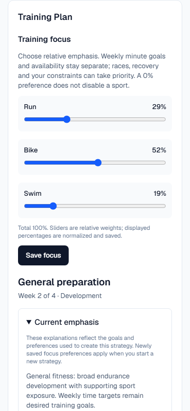

# Training Plan UI checkpoint

The calendar and Training Plan card now separate athlete preferences from the strategy the planner has chosen. Planning architecture, weekly volume goals, block review decisions, and workout progression contracts remain unchanged.

## What the athlete sees

- **Training focus:** Run, Bike and Swim sliders with normalized whole percentages and **Save focus**. A note distinguishes preference, weekly minutes, availability and sport exclusion.
- **Current strategy:** readable phase and current block week. **Current emphasis** and **Week structure** are collapsed by default.
- **Current emphasis:** sport, capability, readable role, the saved focus rationale, and a readable progression strategy. Sports absent from a block have an explicit “No active focus” explanation, without an invented assessment.
- **Apply saved focus to a new strategy:** an explicit, confirmed replacement using the existing block-replan path. It retains the previous block and reviews, and does not regenerate calendar workouts automatically.
- **Calendar selected week:** synchronized with the review selector. **Clear This Week** opens a confirmation with dates and the eligible workout count.
- **Review Week:** primary styling for a completed calendar week. **Review progress so far:** secondary styling for the current week. Both confirm paid usage before submitting; future or unavailable review weeks are disabled. Existing review eligibility remains current/previous saved week inside the active block.

Saving focus does not rewrite the current block. Its explanation continues to describe the preferences used at creation; the UI says this explicitly. Generate or regenerate a week after creating a new strategy to apply it to workouts.

## Data model and strategic selection

`AthleteProfile.content.trainingFocus` is an optional JSON object, for example:

```json
{ "RUN": 30, "BIKE": 50, "SWIM": 20 }
```

No new table, Prisma column, migration, service, AI call or dependency is required. Old profiles remain valid. Unconfigured athletes retain existing block selection behavior; the balanced slider starting point is not saved implicitly.

The shared schema requires three whole values from 0–100, totaling exactly 100. The sliders use relative weights and largest-remainder normalization; the displayed percentages are exactly what is saved. All-zero weights are invalid. Saving uses the existing per-athlete training lock, merges only this profile field, and checks `profileUpdatedAt` to reject stale writes. Existing settings edits preserve this field.

Every database-built block planning context includes the current preference. For general fitness, the deterministic block selector chooses the highest preference among sports whose weekly goal is nonzero or automatic. Ties use the existing rotation where possible; other sports retain supporting maintenance exposure. With no preference, existing rotation remains unchanged. Explicit supplied block focuses still take precedence.

For race-targeted starter strategies, the highest-priority upcoming event still determines the candidate sports and capabilities; preferences order the eligible event sports. A zero-minute goal still excludes a sport. A 0% preference does **not** exclude it. Percentage values never become minute budgets or override availability, restrictions, race timing, recovery roles or review guidance. Subsequent weekly generation uses the chosen persistent strategy through the existing context.

Per-sport explanations come from `DevelopmentFocus.rationale`, which already existed. The block creator now includes actual saved percentages or event names in its rationale where relevant. Frontend mappings only translate labels; they do not generate coaching claims or infer fitness.

## Exact clear-week behavior

The client sends `planId`, `expectedUpdatedAt`, and the athlete-local date of the confirmation to `DELETE /api/calendar`. The server checks origin, session, ownership, plan revision and date under the per-athlete training lock. It rejects clearing while a sync, generation or block review is pending/running.

An eligible workout must:

1. Belong to the selected saved plan.
2. Be dated today or later in the athlete's current time zone; scheduling is day-based.
3. Have no lock and either no completion state or a `PLANNED` state.
4. Have no feedback record.

Past dates, `COMPLETED`, `MODIFIED`, `STOPPED`, locked workouts and all feedback-bearing workouts are retained with their original bodies and states. An entirely past week is a no-op. Both legacy v1 and structured v2 plans are supported without converting their format.

Only the selected weekly plan's JSON and eligible state entries are changed. The weekly-plan row and identity remain. Empty dates receive the existing rest-day representation; sport and weekly planned totals are recomputed, goals remain unchanged, and outdated full-week analysis is removed. An assumption records the clear operation. Existing generation metadata remains provenance of the source plan, not a claim that the cleared schedule was newly generated.

Activities from Strava, manually recorded activities, performance evidence, other weeks, block history and review snapshots are untouched. A stale confirmation or midnight rollover requires reloading and reconfirming. Calendar and weekly-plan details refresh after success. The existing generation path can refill eligible dates while retaining protected workouts.

## Review map: files changed for this checkpoint

| File | Responsibility / review focus |
| --- | --- |
| `packages/shared/src/training-focus.ts` | Percentage schema, save request, deterministic normalization; rounding and all-zero validation. |
| `packages/shared/src/athlete-profile.ts` | Optional focus preference in existing profile JSON. |
| `packages/shared/src/block-planning.ts` | Preference in block context; general-fitness primary selection and grounded rationale. |
| `packages/shared/src/training-block-state.ts` | UI state includes saved focus and profile revision. |
| `packages/shared/src/clear-week.ts` | **Highest-priority review:** eligibility/protection rules, retained workout bodies, totals and plan validation. |
| `packages/shared/src/index.ts` | Exports the new shared schemas/helpers. |
| `packages/db/src/development-blocks.ts` | Loads saved preference into block creation/replan context and existing freshness checks. |
| `packages/db/src/training-block-state.ts` | Partial profile save with revision check, race-aware preference selection, UI state. |
| `packages/db/src/calendar.ts` | **Highest-priority review:** authenticated ownership scope, training lock, busy/stale checks, atomic clear. |
| `apps/web/src/app/api/training-block/route.ts` | Validated `SAVE_FOCUS` action; existing create/replace/review flows reused. |
| `apps/web/src/app/api/calendar/route.ts` | Origin/session protected clear endpoint with useful conflict errors. |
| `apps/web/src/app/training-focus-editor.tsx` | Relative sliders, normalized displayed/saved percentages, save state. |
| `apps/web/src/app/training-block-labels.ts` | Readable roles/progression and completed/current review labels. |
| `apps/web/src/app/training-block-panel.tsx` | Training Plan card, expandable explanations, strategy update, review confirmation/polling. |
| `apps/web/src/app/clear-week-button.tsx` | Frozen confirmation count/version, cancel, pending/error state, safe server request. |
| `apps/web/src/app/training-calendar.tsx` | Calendar week selection, clear control and refresh. |
| `apps/web/src/app/activity-dashboard.tsx` | Shares selected week between calendar/review and propagates plan refresh. |
| `apps/web/src/app/weekly-planner.tsx` | Reloads current/next plan details after external calendar changes. |
| `tests/training-plan-ui.test.mjs` | Eleven tests covering schema, persistence, selection, history protection, endpoints and rendered labels. |
| `scripts/test-strava.mjs`, `scripts/test-all.mjs` | Registers the new isolated integration suite. |
| `scripts/smoke-training-ui.mjs` | Optional real-browser smoke with disposable DB, ephemeral server and synthetic screenshots; no paid AI calls. |
| `docs/screenshots/training-plan-*.png` | Four synthetic desktop/mobile/confirmation screenshots. |
| `docs/mvp-status.md`, this document | Checkpoint status, semantics and review guide. |

## Validation

- Full regression run: **268 tests across 17 suites passed**, using disposable databases and mocked/deterministic providers.
- TypeScript across workspaces, lint, worker compilation and Next.js 16.1.1 production build passed.
- Browser smoke: focus changes save and survive reload; both details sections expand; current/completed review styling follows calendar selection; cancelling a paid review makes no API request; clearing cancels safely, then removes only eligible workouts on confirmation; calendar updates; completed feedback and recorded activity survive; no runtime exceptions or page-level mobile overflow.
- No live OpenAI calls, real athlete mutations or database resets were performed.

Reproduce from the repository root with local Postgres available:

```powershell
npm run build:packages
node scripts/test-strava.mjs training-ui
npm run build --workspace @app/web
node scripts/smoke-training-ui.mjs
```

The browser smoke uses the installed Windows Edge executable, an isolated local port and a temporary browser profile. It requires database permission to create/drop a disposable test database. It stops its own server/browser and removes the test database when finished.

## Screenshots

All data below is synthetic. Preferences were changed after creating the block to demonstrate that saved strategy explanations retain their original context.






## Remaining limits

- Block selection remains the existing deterministic starter strategy, now preference-aware. Percentages rank strategic emphasis; they are not a proportional allocation algorithm or evidence of fitness. Supporting sports can both remain maintenance focuses.
- Saving preferences alone affects future strategy creation/replanning. Existing workout targets change only on an explicit generation request, following existing protection rules.
- Generation still supports current-week remainder and next week; arbitrary-date generation is outside this checkpoint.
- Review eligibility and decisions are unchanged. A completed calendar week is not evidence that every workout was completed.
- Activity-to-workout linking and measured interval execution remain outside scope. Mark completed workouts or provide feedback to protect them; the app does not infer completion from an unlinked activity.
- Cleared dates use the existing “Rest day” representation. There is no dedicated undo; regenerate eligible dates if needed.
